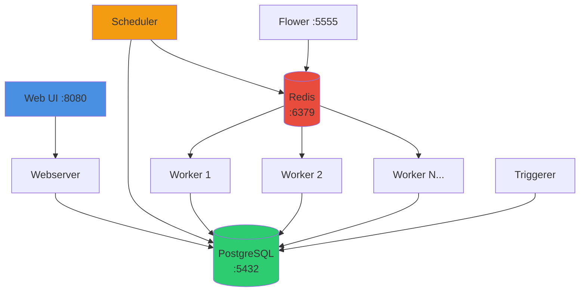
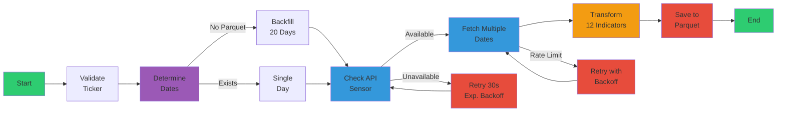

# 🚀 Airflow Market Data Pipeline

<div align="center">

[](https://airflow.apache.org/)
[](https://www.python.org/)
[](https://www.docker.com/)
[](#-testing)
[](#-testing)

**Production-ready Apache Airflow setup with CeleryExecutor, comprehensive testing, and enterprise-grade logging.**

[Features](#-key-features) • [Quick Start](#-quick-start) • [Documentation](#-documentation) • [Architecture](#-architecture) • [Contributing](#-contributing)

</div>

---

## 📋 Table of Contents

- [Overview](#-overview)
- [Key Features](#-key-features)
- [Quick Start](#-quick-start)
- [Documentation](#-documentation)
- [Architecture](#-architecture)
- [Project Structure](#-project-structure)
- [Configuration](#%EF%B8%8F-configuration)
- [Testing](#-testing)
- [Monitoring & Logging](#-monitoring--logging)
- [Troubleshooting](#-troubleshooting)
- [Contributing](#-contributing)
- [License](#-license)

---

## 🎯 Overview

Enterprise-ready Apache Airflow 2.11 deployment with:

- **🔄 CeleryExecutor** for distributed task execution
- **📊 Market Data DAG** for fetching financial data from Yahoo Finance API
- **🧪 Comprehensive Testing** with 82 tests and 84% coverage
- **📝 Centralized Logging** with Sentry/Datadog integration ready
- **🐳 Docker Compose** setup for local development and testing
- **✅ CI/CD Pipeline** with automated testing and linting
- **📚 Complete Documentation** for users, developers, and operators

---

## ✨ Key Features

### 🏗️ Infrastructure

| Feature | Description |
|---------|-------------|
| **PostgreSQL 13** | Metadata database with persistent storage |
| **Redis 7.2** | Message broker for Celery task queue |
| **CeleryExecutor** | Horizontally scalable task execution |
| **Flower** | Web-based Celery monitoring (optional) |
| **Docker Compose** | One-command deployment |

### 💼 Market Data Pipeline (ETL)

#### Extract
- ✅ **Yahoo Finance Integration** - Real-time market data API
- ✅ **Smart Timestamp Logic** - Handles current day vs historical data
- ✅ **Rate Limiting Handling** - Automatic retry with exponential backoff
- ✅ **API Health Sensor** - Proactive availability checking
- ✅ **Multi-Date Fetch** - Fetch 1-20 dates with resilient error handling

#### Transform
- ✅ **12 Technical Indicators** - SMA, RSI, MACD, Bollinger Bands, Volatility, Returns
- ✅ **Data Validation** - Numeric conversion and validation
- ✅ **Pandas Processing** - Efficient DataFrame operations
- ✅ **NaN Handling** - Graceful handling of weekends and missing data

#### Load
- ✅ **Parquet Storage** - Apache Parquet with Snappy compression
- ✅ **Append Mode** - Automatic deduplication by date
- ✅ **Persistent Storage** - Docker volume for data retention
- ✅ **Automatic Backfill** - 20-day backfill on first execution

#### Additional
- ✅ **Daily Automation** - `@daily` schedule (00:00 UTC)
- ✅ **Configurable Parameters** - Environment variables and Airflow Variables
- ✅ **Comprehensive Error Handling** - Multi-level retry logic and logging

### 🔧 Developer Experience

- ✅ **Modular Architecture** - Organized into config, utils, operators, sensors, transformers, storage
- ✅ **131 Unit + Integration Tests** - High test coverage (89%)
- ✅ **Type Hints** - Full Python type annotations
- ✅ **Linting & Formatting** - Black, isort, flake8 enforcement
- ✅ **CI/CD Pipeline** - GitHub Actions automated testing
- ✅ **Local Testing** - Docker Compose test environment

### 📊 Logging & Monitoring

- ✅ **Centralized Logger** - Custom `MarketDataLogger` class
- ✅ **Structured Logging** - Contextual information in every log
- ✅ **Execution Decorators** - Automatic timing and error logging
- ✅ **Metrics Tracking** - Built-in metrics for monitoring
- ✅ **Audit Logging** - Compliance-ready audit trail
- ✅ **Sentry Integration** - Error tracking (optional)
- ✅ **Datadog Integration** - APM and metrics (optional)

---

## 🚀 Quick Start

### Prerequisites

- **Docker Desktop** or Docker Engine (v20.10+)
- **Docker Compose** (v2.0+)
- **4GB RAM** minimum (8GB recommended)
- **2 CPU cores** minimum (4+ recommended)

### 1. Clone and Setup

```bash
# Clone the repository
git clone <repository-url>
cd poc_airflow

# Copy environment template
cp env.template .env

# (Linux only) Set Airflow UID
echo "AIRFLOW_UID=$(id -u)" >> .env
```

### 2. Initialize Airflow

```bash
# Initialize database and create admin user
docker compose up airflow-init
```

### 3. Start Services

```bash
# Start all services
docker compose up -d

# Optional: Start with Flower monitoring
docker compose --profile flower up -d
```

### 4. Access Airflow

Open your browser at **http://localhost:8080**

- **Username**: `airflow`
- **Password**: `airflow`

**Optional - Flower (Celery Monitor)**: http://localhost:5555

### 5. Run Your First DAG

The **`get_market_data`** DAG is ready to use:

1. Go to the DAGs page
2. Toggle the `get_market_data` DAG to **ON**
3. Click **▶️ Trigger DAG** 
4. Optionally, configure parameters (ticker, date)
5. Monitor execution in the Graph or Gantt view

---

## 📚 Documentation

Comprehensive documentation organized by audience:

### 🚦 Getting Started
- **[Installation Guide](docs/getting-started/installation.md)** - Detailed setup instructions
- **[Quick Start Tutorial](docs/getting-started/quick-start.md)** - Your first DAG in 5 minutes
- See [Configuration Guide](docs/user-guide/configuration.md) for configuration options

### 👤 User Guide
- **[Market Data DAG](docs/user-guide/market-data-dag.md)** - Using the Yahoo Finance DAG
- **[Data Warehouse](docs/user-guide/data-warehouse.md)** - Multi-environment warehouse guide
- **[Configuration Options](docs/user-guide/configuration.md)** - All configurable parameters
- **[Airflow Variables](docs/user-guide/airflow-variables.md)** - Dynamic configuration
- **[Logging Guide](docs/user-guide/logging.md)** - Understanding logs

### 👨‍💻 Developer Guide
- **[Architecture Overview](docs/architecture/overview.md)** - Complete system design
- **[Testing Guide](docs/developer-guide/testing.md)** - Running and writing tests
- **[API Reference](docs/developer-guide/api-reference.md)** - Complete module documentation
- **[Code Style](docs/developer-guide/code-style.md)** - Standards and conventions
- **[Contributing](docs/developer-guide/contributing.md)** - How to contribute

### ⚙️ Operations Guide
- **[Deployment](docs/operations/deployment.md)** - Production deployment guide
- **[Monitoring](docs/operations/monitoring.md)** - Observability and alerting
- **[Troubleshooting](docs/operations/troubleshooting.md)** - Common issues and solutions
- **[Migration](docs/operations/migration-guide.md)** - Environment and version migration
- **[Performance Tuning](docs/operations/performance-tuning.md)** - Optimization guide
- **[Security](docs/SECURITY.md)** - Security best practices

### 📖 Reference
- **[Environment Variables](docs/reference/environment-variables.md)** - Complete env var reference
- **[CLI Commands](docs/reference/cli-commands.md)** - Comprehensive CLI reference  
- **[FAQs](docs/reference/faq.md)** - Frequently asked questions
- See [Useful Commands](#-useful-commands) section below for quick reference

---

## 🏗️ Architecture

### System Components



### Market Data DAG Flow (ETL Pipeline)



### Execution Flow

1. **Scheduler** reads DAG files and creates task instances
2. **Tasks** are queued in **Redis** (Celery queue)
3. **Workers** pick up tasks from the queue
4. **Workers** execute tasks and update status in **PostgreSQL**
5. **Webserver** displays real-time status from database
6. **Triggerer** handles asynchronous/deferrable tasks
7. **Flower** monitors Celery workers (optional)

---

## 📁 Project Structure

```
poc_airflow/
├── dags/                          # Airflow DAGs
│   ├── get_market_data_dag.py    # Main ETL pipeline (@daily)
│   └── market_data/              # Modular DAG components
│       ├── config/               # Configuration
│       │   ├── settings.py       # Settings management (triple fallback)
│       │   └── logging_config.py # Logging configuration
│       ├── operators/            # Custom operators
│       │   ├── market_data_operators.py  # Original operators
│       │   └── transform_operators.py    # Transform & backfill logic
│       ├── sensors/              # Custom sensors
│       │   └── api_sensor.py     # API availability check
│       ├── transformers/         # Data transformation 🆕
│       │   └── technical_indicators.py   # 12 technical indicators
│       ├── storage/              # Data persistence 🆕
│       │   └── parquet_storage.py        # Parquet save/load
│       └── utils/                # Utilities
│           ├── api_client.py     # Yahoo Finance client
│           ├── validators.py     # Input validation
│           └── logger.py         # Centralized logging
│
├── data/                         # Parquet storage (persistent) 🆕
│   └── {TICKER}_market_data.parquet
│
├── docs/                         # Documentation
│   ├── getting-started/          # Getting started guides
│   ├── user-guide/              # User documentation
│   ├── developer-guide/         # Developer documentation
│   ├── archive/                 # Archived documentation
│   └── README.md                # Documentation index
│
├── tests/                        # Test suite
│   ├── unit/                    # Unit tests (119 tests)
│   ├── integration/             # Integration tests (12 tests)
│   └── conftest.py              # Pytest fixtures
│
├── logs/                         # Airflow logs (auto-generated)
├── plugins/                      # Custom Airflow plugins
├── config/                       # Additional config files
│
├── docker-compose.yml            # Main services configuration
├── docker-compose.test.yml       # Testing environment
├── env.template                  # Environment variables template
├── requirements.txt              # Python dependencies
├── pytest.ini                    # Pytest configuration
├── .flake8                       # Flake8 configuration
├── .isort.cfg                    # Import sorting configuration
└── README.md                     # This file
```

---

## ⚙️ Configuration

### Environment Variables

Edit `.env` file to customize your installation:

```bash
# Airflow Configuration
AIRFLOW_IMAGE_NAME=apache/airflow:2.11.0-python3.10
AIRFLOW_UID=50000
AIRFLOW__CORE__LOAD_EXAMPLES=false
AIRFLOW__CORE__DAGS_ARE_PAUSED_AT_CREATION=true

# Admin Credentials
_AIRFLOW_WWW_USER_USERNAME=airflow
_AIRFLOW_WWW_USER_PASSWORD=airflow

# Market Data Configuration
MARKET_DATA_DEFAULT_TICKER=AAPL
YAHOO_FINANCE_API_BASE_URL=https://query2.finance.yahoo.com/v8/finance/chart
MARKET_DATA_API_TIMEOUT=30
MARKET_DATA_MAX_RETRIES=3

# Logging Configuration
ENVIRONMENT=development  # development|staging|production
AIRFLOW__LOGGING__LEVEL=INFO
AIRFLOW__LOGGING__JSON_FORMAT=false

# Optional: Monitoring Integration
# SENTRY_DSN=https://your-key@sentry.io/project
# DD_API_KEY=your-datadog-api-key
```

### Airflow Variables

Set dynamic configuration via Airflow UI or CLI:

```bash
# Via CLI
docker compose exec airflow-scheduler airflow variables set market_data_default_ticker TSLA

# Via script
./scripts/setup_airflow_variables.sh
```

**See**: [Configuration Guide](docs/user-guide/configuration.md) and [Airflow Variables Guide](docs/user-guide/airflow-variables.md) for complete details.

---

## 🧪 Testing

### Run All Tests

```bash
# Using Docker Compose
docker compose -f docker-compose.test.yml up test

# Unit tests only
docker compose -f docker-compose.test.yml up test-unit-only

# Integration tests only
docker compose -f docker-compose.test.yml up test-integration-only

# With coverage report
docker compose -f docker-compose.test.yml up test-coverage
```

### Run Linting

```bash
# Run all linters
docker compose -f docker-compose.test.yml up lint

# Individual linters
flake8 dags/market_data
black --check dags/market_data tests/
isort --check-only dags/market_data tests/
```

### Test Coverage

Current coverage: **84.22%**

- **Unit Tests**: 50 tests covering all modules
- **Integration Tests**: 14 tests for DAG workflows
- **Total**: 82 tests passing

**See**: [Testing Guide](docs/developer-guide/testing.md) for details.

---

## 📊 Monitoring & Logging

### Centralized Logging

The project includes a production-ready logging system:

```python
from market_data.utils import get_logger

logger = get_logger(__name__)

# Structured logging
logger.info("Processing data", extra={"ticker": "AAPL", "records": 100})

# Metrics tracking
logger.metric("api.response_time", 1.234, {"endpoint": "/chart"})

# Audit logging
logger.audit("data_fetched", {"user": "airflow", "ticker": "AAPL"})
```

**Features**:
- Contextual information in every log
- Automatic execution timing
- Metrics and audit trails
- Sentry/Datadog integration ready

**See**: [Logging Guide](docs/user-guide/logging.md)

### Monitoring with Flower

Monitor Celery workers in real-time:

```bash
# Start Flower
docker compose --profile flower up -d

# Access at http://localhost:5555
```

Monitor Celery workers and track performance metrics

---

## 🔧 Useful Commands

### Service Management

```bash
# Start services
docker compose up -d

# Stop services
docker compose down

# Restart a service
docker compose restart airflow-worker

# Scale workers
docker compose up -d --scale airflow-worker=3

# View logs
docker compose logs -f airflow-scheduler
```

### Airflow CLI

```bash
# List DAGs
docker compose exec airflow-scheduler airflow dags list

# Test a DAG
docker compose exec airflow-scheduler airflow dags test get_market_data 2025-11-12

# List variables
docker compose exec airflow-scheduler airflow variables list
```

### Database Operations

```bash
# Backup database
docker compose exec postgres pg_dump -U airflow airflow > backup.sql

# Restore database
docker compose exec -T postgres psql -U airflow airflow < backup.sql
```

**See**: Full command reference in sections above

---

## 🐛 Troubleshooting

### Common Issues

| Issue | Solution |
|-------|----------|
| Services not starting | Check `docker compose logs` |
| DAGs not appearing | Verify file in `dags/` and check scheduler logs |
| Port 8080 in use | Change port in `docker-compose.yml` |
| Permission errors (Linux) | Run `sudo chown -R $(id -u):$(id -g) dags logs` |
| Workers not picking tasks | Check Redis connection and restart workers |

For more help, see common solutions above or check Docker logs.

---

## 🤝 Contributing

We welcome contributions! Follow the steps below to contribute.

### Quick Contribution Steps

1. **Fork** the repository
2. **Create a branch** (`git checkout -b feature/amazing-feature`)
3. **Make your changes** and add tests
4. **Run tests** (`docker compose -f docker-compose.test.yml up test`)
5. **Commit** (`git commit -m 'Add amazing feature'`)
6. **Push** (`git push origin feature/amazing-feature`)
7. **Open a Pull Request**

### Development Standards

- ✅ All tests must pass
- ✅ Code coverage > 70%
- ✅ Follow Black formatting
- ✅ Pass flake8 linting
- ✅ Add docstrings to new functions
- ✅ Update documentation as needed

---

## 📄 License

This project uses Apache Airflow, which is licensed under the [Apache License 2.0](https://www.apache.org/licenses/LICENSE-2.0).

---

## 🌟 Acknowledgments

- **Apache Airflow** - Workflow orchestration platform
- **Yahoo Finance API** - Market data source
- **Docker** - Containerization platform

---

## 📞 Support

- 📖 [Documentation](docs/README.md)
- 🐛 [Issue Tracker](https://github.com/avalosjuancarlos/poc_airflow/issues)
- 💬 [Discussions](https://github.com/avalosjuancarlos/poc_airflow/discussions)
- 📧 Email: support@example.com

---

<div align="center">

**Built with ❤️ using Apache Airflow**

[⬆ back to top](#-airflow-market-data-pipeline)

</div>
