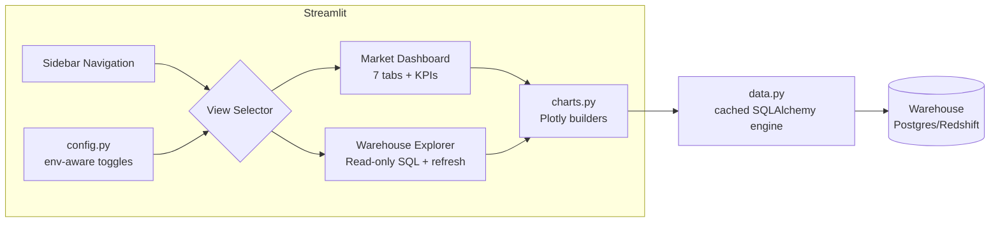
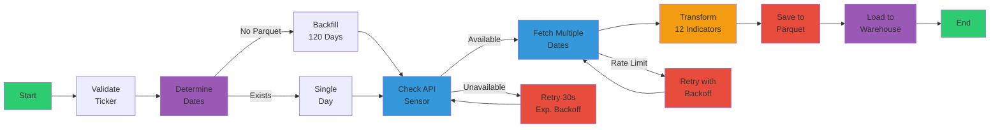

# 🚀 Airflow Market Data Pipeline

<div align="center">

[](https://airflow.apache.org/)
[](https://www.python.org/)
[](https://www.docker.com/)
[](#-testing)
[](#-testing)

**Automated ETL pipeline to fetch, transform, and store market data using Apache Airflow.**

[Features](#-key-features) • [Quick Start](#-quick-start) • [Documentation](#-documentation) • [Architecture](#-architecture) • [Contributing](#-contributing)

</div>

---

## 📖 What is this project?

This project is a **complete, production-ready ETL (Extract, Transform, Load) pipeline** that automates the extraction and processing of financial market data from stock markets.

### 🎯 What does it do?

The pipeline performs the following operations **automatically** every day at 6:00 PM ET (post market close):

1. **📊 Extracts** market data from Yahoo Finance API
   - Prices (Open, High, Low, Close)
   - Trading volume
   - Ticker metadata (52-week high/low, market cap, etc.)

2. **🔄 Transforms** data by calculating 12 technical indicators
   - **Trend**: SMA (7, 14, 30 days), MACD
   - **Momentum**: RSI (Relative Strength Index)
   - **Volatility**: Bollinger Bands, 20-day standard deviation
   - **Returns**: Daily percentage change

3. **💾 Stores** enriched data in two layers
   - **Parquet**: Efficient local storage (compressed columnar format)
   - **Data Warehouse**: PostgreSQL (development) or Amazon Redshift (production)

### 🌟 What is it useful for?

- **Technical Analysis**: All indicators calculated and ready to use
- **Backtesting**: Historical data to test trading strategies
- **Dashboards**: Data source for visualizations (Tableau, Power BI, Grafana)
- **Machine Learning**: Clean dataset for predictive models
- **Reports**: Consolidated data for financial reporting

### ⚡ Why use this project?

- ✅ **Zero manual configuration**: Everything automated with Airflow
- ✅ **Clean and validated data**: No worries about API errors
- ✅ **Pre-calculated indicators**: No need to calculate them yourself
- ✅ **Multi-environment**: Local development, staging, and production
- ✅ **Scalable**: From 1 ticker to hundreds with simple configuration
- ✅ **Production-ready**: Testing, logging, monitoring included

### 🔧 How does it work?

```
┌─────────────┐
│ Yahoo       │
│ Finance API │ ────► Fetches OHLCV data
└─────────────┘
       │
       ▼
┌─────────────┐
│ Airflow DAG │ ────► Orchestrates ETL flow
└─────────────┘
       │
       ▼
┌─────────────┐
│ Pandas      │ ────► Calculates 12 technical indicators
└─────────────┘
       │
       ├────► Parquet (.parquet files)
       │      • Fast
       │      • Compressed
       │      • Versioned
       │
       └────► Data Warehouse (PostgreSQL/Redshift)
              • SQL queries
              • Analytics
              • BI Tools
```

### 📅 Daily Execution Example

```
6:00 PM ET (Monday-Friday):
├─ Validates ticker (AAPL)
├─ Determines which dates to fetch
│  └─ First time: last 120 days (~6 months)
│  └─ Daily: today only
├─ Checks if API is available
├─ Fetches data from Yahoo Finance
│  └─ Open: $259.45
│  └─ High: $260.61
│  └─ Low: $258.32
│  └─ Close: $259.57
│  └─ Volume: 54,123,456
├─ Calculates indicators
│  └─ SMA(7): $258.23
│  └─ RSI: 68.42
│  └─ MACD: 1.23
│  └─ Bollinger Upper: $262.15
│  └─ Volatility: 0.0156 (1.56%)
├─ Saves to Parquet
│  └─ /opt/airflow/data/AAPL_market_data.parquet
└─ Loads to Data Warehouse
   └─ PostgreSQL: 15 records inserted ✅
```

---

## 📋 Table of Contents

- [Overview](#-overview)
- [Key Features](#-key-features)
- [Quick Start](#-quick-start)
- [Dashboard](#-dashboard)
- [Documentation](#-documentation)
- [Architecture](#-architecture)
- [Project Structure](#-project-structure)
- [Configuration](#%EF%B8%8F-configuration)
- [Testing](#-testing)
- [Monitoring & Logging](#-monitoring--logging)
- [Troubleshooting](#-troubleshooting)
- [Contributing](#-contributing)
- [License](#-license)

---

## 🎯 Overview

Enterprise-ready Apache Airflow 2.11 deployment with:

- **🔄 CeleryExecutor** for distributed task execution
- **📊 Market Data DAG** for fetching financial data from Yahoo Finance API
- **🧪 Comprehensive Testing** with 82 tests and 84% coverage
- **📝 Centralized Logging** with extensible architecture for monitoring integrations
- **🐳 Docker Compose** setup for local development and testing
- **✅ CI/CD Pipeline** with automated testing and linting
- **📚 Complete Documentation** for users, developers, and operators

---

## ✨ Key Features

### 🏗️ Infrastructure

| Feature | Description |
|---------|-------------|
| **PostgreSQL 13** | Metadata database with persistent storage |
| **Redis 7.2** | Message broker for Celery task queue |
| **CeleryExecutor** | Horizontally scalable task execution |
| **Flower** | Web-based Celery monitoring (optional) |
| **Docker Compose** | One-command deployment |

### 💼 Market Data Pipeline (ETL)

#### Extract
- ✅ **Yahoo Finance Integration** - Real-time market data API
- ✅ **Smart Timestamp Logic** - Handles current day vs historical data
- ✅ **Rate Limiting Handling** - Automatic retry with exponential backoff
- ✅ **API Health Sensor** - Proactive availability checking
- ✅ **Multi-Date Fetch** - Fetch 1-20 dates with resilient error handling

#### Transform
- ✅ **12 Technical Indicators** - SMA, RSI, MACD, Bollinger Bands, Volatility, Returns
- ✅ **Data Validation** - Numeric conversion and validation
- ✅ **Pandas Processing** - Efficient DataFrame operations
- ✅ **NaN Handling** - Graceful handling of weekends and missing data

#### Load
- ✅ **Parquet Storage** - Apache Parquet with Snappy compression
- ✅ **Append Mode** - Automatic deduplication by date
- ✅ **Persistent Storage** - Docker volume for data retention
- ✅ **Automatic Backfill** - 120-day backfill on first execution (~6 months)
- ✅ **Data Warehouse** - PostgreSQL (dev) / Redshift (staging/prod)
- ✅ **UPSERT Strategy** - Insert new, update existing records

#### Additional
- ✅ **Daily Automation** - `@daily` schedule (00:00 UTC)
- ✅ **Configurable Parameters** - Environment variables and Airflow Variables
- ✅ **Comprehensive Error Handling** - Multi-level retry logic and logging
- ✅ **Metadata Flattening** - Company names and 52-week stats stored with each record
- ✅ **Multi-Ticker DAG Runs** - Supply `tickers=["AAPL","MSFT",...]` to process several symbols per execution with isolated Parquet caches and warehouse upserts

### 🔧 Developer Experience

- ✅ **Modular Architecture** - Organized into config, utils, operators, sensors, transformers, storage, warehouse
- ✅ **142 Unit + Integration Tests** - 78% test coverage
- ✅ **Type Hints** - Full Python type annotations
- ✅ **Linting & Formatting** - Black, isort, flake8 enforcement
- ✅ **CI/CD Pipeline** - GitHub Actions automated testing
- ✅ **Local Testing** - Docker Compose test environment
- ✅ **Makefile** - 40+ commands for common tasks
- ✅ **Interactive Dashboard** - Streamlit market view with seven analytic tabs & metrics
- ✅ **Modular Dashboard Code** - Streamlit split into `config`, `data`, `charts`, and `views/*` modules for easier reuse and testing
- ✅ **Warehouse Explorer GUI** - Read-only SQL explorer with filters, download, refresh button, and guard rails against injections or DDL/DML operations
- ✅ **Configurable Views** - Enable/disable each experience or set the default landing page per environment

### 📊 Logging & Monitoring

- ✅ **Centralized Logger** - Custom `MarketDataLogger` class
- ✅ **Structured Logging** - Contextual information in every log
- ✅ **Execution Decorators** - Automatic timing and error logging
- ✅ **Metrics Tracking** - Built-in metrics for monitoring
- ✅ **Audit Logging** - Compliance-ready audit trail
- ✅ **Extensible Logging** - Architecture ready for external monitoring tools (Sentry, Datadog, etc.)

---

## 🚀 Quick Start

### Prerequisites

- **Docker Desktop** or Docker Engine (v20.10+)
- **Docker Compose** (v2.0+)
- **4GB RAM** minimum (8GB recommended)
- **2 CPU cores** minimum (4+ recommended)

### 1. Clone and Setup

```bash
# Clone the repository
git clone https://github.com/avalosjuancarlos/poc_airflow.git
cd poc_airflow

# Copy environment template
cp env.template .env

# (Linux only) Set Airflow UID
echo "AIRFLOW_UID=$(id -u)" >> .env
```

### 2. Initialize Airflow

```bash
# Initialize database and create admin user
docker compose up airflow-init
```

### 3. Start Services

```bash
# Start all services
docker compose up -d

# Optional: Start with Flower monitoring
docker compose --profile flower up -d
```

### 4. Access Airflow

Open your browser at **http://localhost:8080**

- **Username**: `airflow`
- **Password**: `airflow`

**Optional - Flower (Celery Monitor)**: http://localhost:5555

### 5. Run Your First DAG

The **`get_market_data`** DAG is ready to use:

1. Go to the DAGs page
2. Toggle the `get_market_data` DAG to **ON**
3. Click **▶️ Trigger DAG** 
4. Optionally, configure parameters (ticker, date)
5. Monitor execution in the Graph or Gantt view

---

## 🖥️ Dashboard

The dashboard ships with two Streamlit experiences that share the same deployment:

- **Market Data Dashboard** – seven responsive tabs (Price & Volume, Moving Averages, Bollinger Bands, RSI, MACD, Returns & Volatility, Raw Data) plus KPI tiles and CSV export.
- **Warehouse Explorer** – schema-aware, read-only SQL browser with ticker/date filters, validated custom predicates, Plotly summaries, CSV downloads, and a `🔄 Refresh warehouse data` button that clears caches before re-running the query.

Start it with:

```bash
make dashboard
# Access http://localhost:8501
```

### View configuration

Control which experience is visible (or which one loads by default) per environment:

```bash
# dashboard/.env
ENABLE_MARKET_VIEW=true
ENABLE_WAREHOUSE_VIEW=true
DEFAULT_DASHBOARD_VIEW=market  # or "warehouse"
```

Toggle the navigation radio in the sidebar to jump between views at runtime. When new data is loaded into the warehouse, use the refresh button inside the Warehouse Explorer view to rerun the SQL without restarting Streamlit. All explorer queries are enforced as read-only (`SELECT` only) and custom filters are sanitized to prevent SQL injection or destructive statements.



---

## 📚 Documentation

Comprehensive documentation organized by audience:

### 🚦 Getting Started
- **[Installation Guide](docs/getting-started/installation.md)** - Detailed setup instructions
- **[Quick Start Tutorial](docs/getting-started/quick-start.md)** - Your first DAG in 5 minutes
- See [Configuration Guide](docs/user-guide/configuration.md) for configuration options

### 👤 User Guide
- **[Market Data DAG](docs/user-guide/market-data-dag.md)** - Using the Yahoo Finance DAG
- **[Data Warehouse](docs/user-guide/data-warehouse.md)** - Multi-environment warehouse guide
- **[Dashboard](docs/user-guide/dashboard.md)** - Interactive web dashboard
- **[Configuration Options](docs/user-guide/configuration.md)** - All configurable parameters
- **[Airflow Variables](docs/user-guide/airflow-variables.md)** - Dynamic configuration
- **[Logging Guide](docs/user-guide/logging.md)** - Understanding logs

### 👨‍💻 Developer Guide
- **[Architecture Overview](docs/architecture/overview.md)** - Complete system design
- **[Testing Guide](docs/developer-guide/testing.md)** - Running and writing tests
- **[API Reference](docs/developer-guide/api-reference.md)** - Complete module documentation
- **[Code Style](docs/developer-guide/code-style.md)** - Standards and conventions
- **[Contributing](docs/developer-guide/contributing.md)** - How to contribute

### ⚙️ Operations Guide
- **[Deployment](docs/operations/deployment.md)** - Production deployment guide
- **[Monitoring](docs/operations/monitoring.md)** - Observability and alerting
- **[Troubleshooting](docs/operations/troubleshooting.md)** - Common issues and solutions
- **[Migration](docs/operations/migration-guide.md)** - Environment and version migration
- **[Performance Tuning](docs/operations/performance-tuning.md)** - Optimization guide
- **[Security](docs/SECURITY.md)** - Security best practices

### 📖 Reference
- **[Environment Variables](docs/reference/environment-variables.md)** - Complete env var reference
- **[CLI Commands](docs/reference/cli-commands.md)** - Comprehensive CLI reference  
- **[FAQs](docs/reference/faq.md)** - Frequently asked questions
- See [Useful Commands](#-useful-commands) section below for quick reference

---

## 🏗️ Architecture

### System Components


### Market Data DAG Flow (ETL Pipeline)



### Execution Flow

1. **Scheduler** reads DAG files and creates task instances
2. **Tasks** are queued in **Redis** (Celery queue)
3. **Workers** pick up tasks from the queue
4. **Workers** execute tasks and update status in **PostgreSQL**
5. **Webserver** displays real-time status from database
6. **Triggerer** handles asynchronous/deferrable tasks
7. **Flower** monitors Celery workers (optional)

---

## 📁 Project Structure

```
poc_airflow/
├── dags/                          # Airflow DAGs
│   ├── get_market_data_dag.py    # Main ETL pipeline (@daily)
│   └── market_data/              # Modular DAG components
│       ├── config/               # Configuration
│       │   ├── settings.py       # Settings management (triple fallback)
│       │   └── logging_config.py # Logging configuration
│       ├── operators/            # Custom operators
│       │   ├── market_data_operators.py  # Original operators
│       │   └── transform_operators.py    # Transform & backfill logic
│       ├── sensors/              # Custom sensors
│       │   └── api_sensor.py     # API availability check
│       ├── transformers/         # Data transformation 🆕
│       │   └── technical_indicators.py   # 12 technical indicators
│       ├── storage/              # Data persistence 🆕
│       │   └── parquet_storage.py        # Parquet save/load
│       └── utils/                # Utilities
│           ├── api_client.py     # Yahoo Finance client
│           ├── validators.py     # Input validation
│           └── logger.py         # Centralized logging
│
├── data/                         # Parquet storage (persistent) 🆕
│   └── {TICKER}_market_data.parquet
│
├── docs/                         # Documentation
│   ├── getting-started/          # Getting started guides
│   ├── user-guide/               # User documentation
│   ├── developer-guide/          # Developer documentation
│   ├── archive/                  # Archived documentation
│   └── README.md                 # Documentation index
│
├── dashboard/                    # Streamlit dashboard (modular)
│   ├── app.py                    # Entry point (view selector only)
│   ├── config.py                 # Environment + UI configuration helpers
│   ├── data.py                   # Cached DB engine + query helpers
│   ├── charts.py                 # Plotly chart builders
│   └── views/                    # Independent Streamlit views
│       ├── __init__.py
│       ├── market.py             # Market analytics tabs
│       └── warehouse.py          # Warehouse Explorer (read-only SQL)
│   ├── Dockerfile                # Streamlit image
│   ├── docker-compose.yml        # Dashboard-only compose file
│   └── requirements.txt          # Dashboard dependencies
│
├── tests/                        # Test suite
│   ├── unit/                     # Unit tests (119 tests)
│   ├── integration/              # Integration tests (12 tests)
│   └── conftest.py               # Pytest fixtures
│
├── logs/                         # Airflow logs (auto-generated)
├── plugins/                      # Custom Airflow plugins
├── config/                       # Additional config files
│
├── docker-compose.yml            # Main services configuration
├── docker-compose.test.yml       # Testing environment
├── env.template                  # Environment variables template
├── requirements.txt              # Runtime Python dependencies
├── requirements-dev.txt          # Dev/test/lint dependencies (extends requirements.txt)
├── pytest.ini                    # Pytest configuration
├── .flake8                       # Flake8 configuration
├── .isort.cfg                    # Import sorting configuration
└── README.md                     # This file
```

---

## ⚙️ Configuration

### Environment Variables

Edit `.env` file to customize your installation:

```bash
# Airflow Configuration
AIRFLOW_IMAGE_NAME=apache/airflow:2.11.0-python3.10
AIRFLOW_UID=50000
AIRFLOW__CORE__LOAD_EXAMPLES=false
AIRFLOW__CORE__DAGS_ARE_PAUSED_AT_CREATION=true

# Admin Credentials
_AIRFLOW_WWW_USER_USERNAME=airflow
_AIRFLOW_WWW_USER_PASSWORD=airflow

# Market Data Configuration
# JSON or CSV list of default tickers for bulk runs
MARKET_DATA_DEFAULT_TICKERS=["AAPL","MSFT"]
MARKET_DATA_BACKFILL_DAYS=120  # Days to backfill on first run
YAHOO_FINANCE_API_BASE_URL=https://query2.finance.yahoo.com/v8/finance/chart
MARKET_DATA_API_TIMEOUT=30
MARKET_DATA_MAX_RETRIES=3

# Data Warehouse Configuration
ENVIRONMENT=development  # development|staging|production
DEV_WAREHOUSE_HOST=warehouse-postgres
DEV_WAREHOUSE_PORT=5432
DEV_WAREHOUSE_DATABASE=market_data_warehouse

# Logging Configuration
AIRFLOW__LOGGING__LEVEL=INFO
AIRFLOW__LOGGING__JSON_FORMAT=false

# Optional: Monitoring Integration
# See docs/user-guide/logging.md for adding Sentry, Datadog, or other tools
```

> ℹ️ **Tip:** Docker Compose exports these variables to every Airflow component (scheduler, workers, triggerer, webserver). After editing `.env`, restart the stack (`make down && make up`) so the DAG UI loads the new defaults (e.g., updated `MARKET_DATA_DEFAULT_TICKERS`).

### Airflow Variables

Set dynamic configuration via Airflow UI or CLI:

```bash
# Via CLI
docker compose exec airflow-scheduler airflow variables set market_data_default_tickers TSLA

# Via script
./scripts/setup_airflow_variables.sh
```

**See**: [Configuration Guide](docs/user-guide/configuration.md) and [Airflow Variables Guide](docs/user-guide/airflow-variables.md) for complete details.

---

## 🧪 Testing

### Run All Tests

```bash
# Using Docker Compose
docker compose -f docker-compose.test.yml up test

# Unit tests only
docker compose -f docker-compose.test.yml up test-unit-only

# Integration tests only
docker compose -f docker-compose.test.yml up test-integration-only

# With coverage report
docker compose -f docker-compose.test.yml up test-coverage
```
> ℹ️ Estos servicios instalan automáticamente las dependencias declaradas en `requirements-dev.txt` (incluye `requirements.txt`).

### Run Linting

```bash
# Run all linters
docker compose -f docker-compose.test.yml up lint

# Individual linters
docker compose -f docker-compose.test.yml run --rm lint bash -lc "flake8 dags/market_data tests/"
docker compose -f docker-compose.test.yml run --rm lint bash -lc "black dags/market_data tests/"
docker compose -f docker-compose.test.yml run --rm lint bash -lc "isort dags/market_data tests/"
```

### Test Coverage

Current coverage: **84.22%**

- **Unit Tests**: 50 tests covering all modules
- **Integration Tests**: 14 tests for DAG workflows
- **Total**: 82 tests passing

**See**: [Testing Guide](docs/developer-guide/testing.md) for details.

---

## 📊 Monitoring & Logging

### Centralized Logging

The project includes a production-ready logging system:

```python
from market_data.utils import get_logger

logger = get_logger(__name__)

# Structured logging
logger.info("Processing data", extra={"ticker": "AAPL", "records": 100})

# Metrics tracking
logger.metric("api.response_time", 1.234, {"endpoint": "/chart"})

# Audit logging
logger.audit("data_fetched", {"user": "airflow", "ticker": "AAPL"})
```

**Features**:
- Contextual information in every log
- Automatic execution timing
- Metrics and audit trails
- Extensible architecture for monitoring tools

**See**: [Logging Guide](docs/user-guide/logging.md)

### Monitoring with Flower

Monitor Celery workers in real-time:

```bash
# Start Flower
docker compose --profile flower up -d

# Access at http://localhost:5555
```

Monitor Celery workers and track performance metrics

---

## 🔧 Useful Commands

### Service Management

```bash
# Start services
docker compose up -d

# Stop services
docker compose down

# Restart a service
docker compose restart airflow-worker

# Scale workers
docker compose up -d --scale airflow-worker=3

# View logs
docker compose logs -f airflow-scheduler
```

### Airflow CLI

```bash
# List DAGs
docker compose exec airflow-scheduler airflow dags list

# Test a DAG
docker compose exec airflow-scheduler airflow dags test get_market_data 2025-11-12

# List variables
docker compose exec airflow-scheduler airflow variables list
```

### Database Operations

```bash
# Backup database
docker compose exec postgres pg_dump -U airflow airflow > backup.sql

# Restore database
docker compose exec -T postgres psql -U airflow airflow < backup.sql
```

**See**: Full command reference in sections above

---

## 🐛 Troubleshooting

### Common Issues

| Issue | Solution |
|-------|----------|
| Services not starting | Check `docker compose logs` |
| DAGs not appearing | Verify file in `dags/` and check scheduler logs |
| Port 8080 in use | Change port in `docker-compose.yml` |
| Permission errors (Linux) | Run `sudo chown -R $(id -u):$(id -g) dags logs` |
| Workers not picking tasks | Check Redis connection and restart workers |

For more help, see common solutions above or check Docker logs.

---

## 🤝 Contributing

We welcome contributions! Follow the steps below to contribute.

### Quick Contribution Steps

1. **Fork** the repository
2. **Create a branch** (`git checkout -b feature/amazing-feature`)
3. **Make your changes** and add tests
4. **Run tests** (`docker compose -f docker-compose.test.yml up test`)
5. **Commit** (`git commit -m 'Add amazing feature'`)
6. **Push** (`git push origin feature/amazing-feature`)
7. **Open a Pull Request**

### Development Standards

- ✅ All tests must pass
- ✅ Code coverage > 70%
- ✅ Follow Black formatting
- ✅ Pass flake8 linting
- ✅ Add docstrings to new functions
- ✅ Update documentation as needed

---

## 📄 License

This project uses Apache Airflow, which is licensed under the [Apache License 2.0](https://www.apache.org/licenses/LICENSE-2.0).

---

## 🌟 Acknowledgments

- **Apache Airflow** - Workflow orchestration platform
- **Yahoo Finance API** - Market data source
- **Docker** - Containerization platform

---

## 📞 Support

- 📖 [Documentation](docs/README.md)
- 🐛 [Issue Tracker](https://github.com/avalosjuancarlos/poc_airflow/issues)
- 💬 [Discussions](https://github.com/avalosjuancarlos/poc_airflow/discussions)
- 📧 Email: support@example.com

---

<div align="center">

**Built with ❤️ using Apache Airflow**

[⬆ back to top](#-airflow-market-data-pipeline)

</div>
