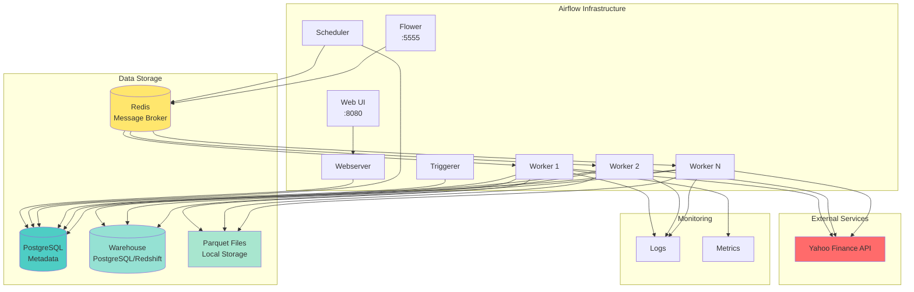
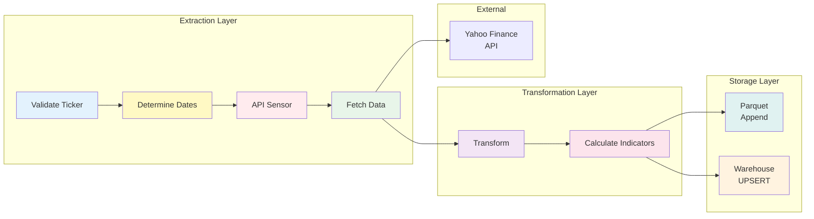
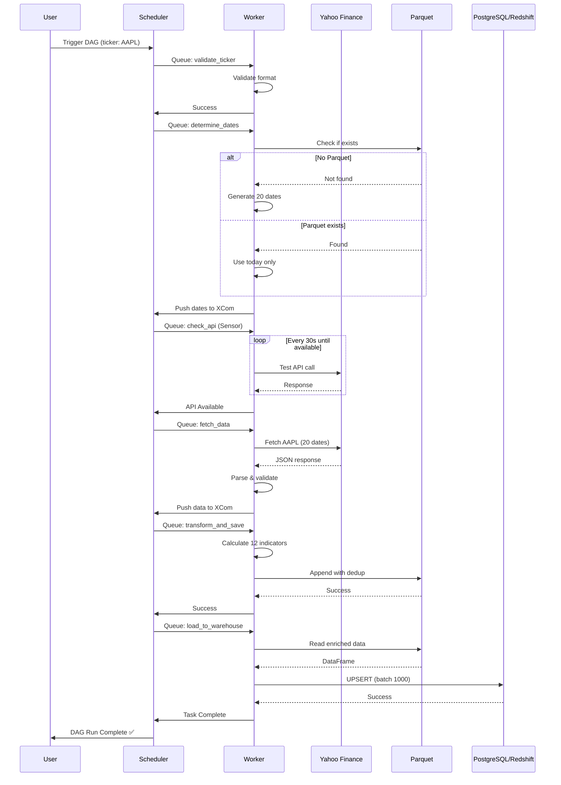

# Architecture Overview

Complete system design and architecture documentation for the Airflow Market Data Pipeline.

---

## Table of Contents

- [System Overview](#system-overview)
- [Component Architecture](#component-architecture)
- [Data Flow](#data-flow)
- [Infrastructure](#infrastructure)
- [Design Decisions](#design-decisions)
- [Scalability & Performance](#scalability--performance)
- [Security Architecture](#security-architecture)

---

## System Overview

### High-Level Architecture



### System Components

| Component | Technology | Purpose | Scalability |
|-----------|-----------|---------|-------------|
| **Webserver** | Flask | UI and API | Horizontal (stateless) |
| **Scheduler** | Airflow Core | Task scheduling | Active/standby (HA) |
| **Workers** | Celery | Task execution | Horizontal (unlimited) |
| **Triggerer** | asyncio | Deferrable tasks | Horizontal |
| **Metadata DB** | PostgreSQL 13 | State management | Vertical + replication |
| **Message Broker** | Redis 7.2 | Task queue | Sentinel/Cluster |
| **Data Warehouse** | PostgreSQL/Redshift | Analytics storage | Vertical (PG) / Elastic (RS) |
| **Flower** | Celery Monitor | Worker monitoring | Single instance |

---

## Component Architecture

### Airflow Core Services

#### 1. Scheduler

**Responsibilities**:
- Parse DAG files every 30 seconds
- Create task instances based on schedule
- Queue tasks to Celery (via Redis)
- Handle task retries and failures
- Manage DAG dependencies

**Configuration**:
```yaml
AIRFLOW__SCHEDULER__DAG_DIR_LIST_INTERVAL: 30
AIRFLOW__SCHEDULER__PARSING_PROCESSES: 2
AIRFLOW__SCHEDULER__MAX_THREADS: 2
```

**High Availability**:
- Active/standby setup possible
- Multiple schedulers supported (Airflow 2.11+)
- Requires shared filesystem for DAGs

#### 2. Workers (Celery)

**Responsibilities**:
- Execute PythonOperator tasks
- Report task status to metadata DB
- Pull tasks from Redis queue
- Respect concurrency limits

**Scaling Strategy**:
```bash
# Scale to 5 workers
docker compose up -d --scale airflow-worker=5

# Each worker can run multiple tasks (default: 16)
AIRFLOW__CELERY__WORKER_CONCURRENCY: 16
```

**Resource Allocation**:
- Memory: 512MB-1GB per worker
- CPU: 1-2 cores per worker
- Disk: Shared with host (logs, data)

#### 3. Webserver

**Responsibilities**:
- Serve UI (React frontend)
- REST API for DAG/task operations
- Authentication & authorization
- DAG/task visualization

**Load Balancing**:
- Stateless (session in DB)
- Can run multiple instances
- Use nginx/HAProxy for load balancing

#### 4. Triggerer

**Responsibilities**:
- Handle deferrable tasks (Sensors)
- Async I/O for efficient waiting
- Reduces worker load for long-waiting tasks

**Usage in Project**:
- `PythonSensor` for API availability check
- Frees workers during 30s poke intervals

---

### Market Data Pipeline Architecture



#### Modular Design

**Directory Structure**:
```
dags/market_data/
├── config/              # Configuration management
│   ├── settings.py      # Triple-fallback config
│   ├── logging_config.py
│   └── warehouse_config.py
├── operators/           # Task callables
│   ├── market_data_operators.py
│   ├── transform_operators.py
│   └── warehouse_operators.py
├── sensors/             # Custom sensors
│   └── api_sensor.py
├── utils/               # Shared utilities
│   ├── api_client.py    # Yahoo Finance client
│   ├── validators.py    # Input validation
│   └── logger.py        # Centralized logging
├── transformers/        # Data transformations
│   └── technical_indicators.py
├── storage/             # Data persistence
│   └── parquet_storage.py
└── warehouse/           # Data warehouse
    ├── connection.py    # Connection pooling
    └── loader.py        # Load strategies
```

**Design Principles**:
- ✅ **Single Responsibility**: Each module has one purpose
- ✅ **Dependency Injection**: Config passed as parameters
- ✅ **Testability**: All modules have unit tests (78% coverage)
- ✅ **Reusability**: Utils can be imported by any DAG
- ✅ **Loose Coupling**: Modules communicate via interfaces

---

## Data Flow

### End-to-End Data Journey



### Data Transformations

| Stage | Input | Transformation | Output |
|-------|-------|----------------|--------|
| **Extraction** | Ticker + Date | Yahoo Finance API call | Raw JSON |
| **Parsing** | Raw JSON | Extract OHLCV + metadata | Python dict |
| **Validation** | Python dict | Type conversion, null checks | Pandas DataFrame |
| **Enrichment** | DataFrame | Calculate 12 indicators | Enriched DataFrame |
| **Persistence** | Enriched DataFrame | Parquet write with dedup | `.parquet` file |
| **Warehouse** | Parquet file | Filter, batch, UPSERT | PostgreSQL/Redshift table |

---

## Infrastructure

### Docker Compose Services

```yaml
services:
  # Airflow Core
  postgres:          # Metadata DB (Airflow state)
  redis:             # Message broker (Celery queue)
  airflow-webserver: # UI :8080
  airflow-scheduler: # Task scheduling
  airflow-worker:    # Task execution (scalable)
  airflow-triggerer: # Async tasks
  
  # Data Warehouse
  warehouse-postgres: # Development warehouse :5433
  
  # Monitoring (optional)
  flower:            # Celery monitor :5555
```

### Network Architecture

```
┌──────────────────────────────────────────────────────────┐
│ Docker Network: poc_airflow_default                      │
│                                                           │
│  ┌─────────────┐    ┌─────────────┐    ┌─────────────┐ │
│  │ Webserver   │    │ Scheduler   │    │ Worker x N  │ │
│  │ :8080       │    │             │    │             │ │
│  └──────┬──────┘    └──────┬──────┘    └──────┬──────┘ │
│         │                  │                   │         │
│         └──────────────────┴───────────────────┘         │
│                           │                              │
│         ┌─────────────────┴─────────────────┐           │
│         │                                   │           │
│    ┌────▼───────┐                  ┌───────▼────┐      │
│    │ PostgreSQL │                  │   Redis    │      │
│    │ :5432      │                  │   :6379    │      │
│    └────────────┘                  └────────────┘      │
│                                                          │
│    ┌────────────────┐                                   │
│    │ Warehouse DB   │                                   │
│    │ :5433          │                                   │
│    └────────────────┘                                   │
└──────────────────────────────────────────────────────────┘
         │                          │
         │ (Host ports)             │
         ▼                          ▼
    localhost:8080          localhost:5433
```

### Volume Management

| Volume | Purpose | Persistence |
|--------|---------|-------------|
| `postgres-db-volume` | Airflow metadata | ✅ Persistent |
| `warehouse-db-volume` | Warehouse data | ✅ Persistent |
| `./dags` | DAG files | 🔗 Bind mount |
| `./logs` | Airflow logs | 🔗 Bind mount |
| `./data` | Parquet files | 🔗 Bind mount |
| `./plugins` | Custom plugins | 🔗 Bind mount |

**Backup Strategy**:
```bash
# Backup metadata DB
docker compose exec postgres pg_dump -U airflow airflow > backup_metadata.sql

# Backup warehouse
docker compose exec warehouse-postgres pg_dump -U warehouse_user market_data_warehouse > backup_warehouse.sql

# Backup Parquet files (already on host)
tar -czf data_backup.tar.gz ./data/
```

---

## Design Decisions

### Why CeleryExecutor?

**Alternatives Considered**:
- ❌ **SequentialExecutor**: No parallelism, development only
- ❌ **LocalExecutor**: Limited to single machine
- ✅ **CeleryExecutor**: Chosen for horizontal scalability
- ❌ **KubernetesExecutor**: Overkill for current scale

**Rationale**:
- Supports multiple workers across machines
- Proven at scale (Airbnb, Lyft use it)
- Simple deployment with Docker Compose
- Can scale from 1 to 100+ workers

### Why PostgreSQL for Warehouse (Dev)?

**Alternatives Considered**:
- ❌ **SQLite**: Not suitable for concurrent writes
- ✅ **PostgreSQL**: Chosen for dev environment
- ✅ **Redshift**: Chosen for staging/production
- ❌ **BigQuery**: Vendor lock-in, overkill

**Rationale**:
- Dev: PostgreSQL is free, fast, Docker-friendly
- Prod: Redshift for analytics workloads
- Consistent SQL dialect (PostgreSQL-compatible)
- Easy migration path

### Why Parquet?

**Alternatives Considered**:
- ❌ **CSV**: No compression, slow queries
- ❌ **JSON**: Large file sizes
- ✅ **Parquet**: Chosen for analytics
- ❌ **Avro**: Better for streaming, not analytics

**Rationale**:
- Columnar storage = fast queries
- Snappy compression = small files
- Schema evolution support
- Native Pandas/PyArrow support

### Configuration Triple-Fallback

```python
# Priority: Airflow Variable > Env Var > Default
ticker = Variable.get("market_data_default_tickers", 
                      default_var=os.environ.get("MARKET_DATA_DEFAULT_TICKERS", 
                                                  "AAPL"))
```

**Benefits**:
- ✅ Runtime changes via Airflow UI
- ✅ Environment-specific via .env
- ✅ Sensible defaults for quick start
- ✅ No code changes needed

---

## Scalability & Performance

### Horizontal Scaling

**Workers**:
```bash
# Scale to 10 workers
docker compose up -d --scale airflow-worker=10

# Each handles 16 concurrent tasks
# Total capacity: 160 tasks
```

**Scheduler** (Airflow 2.11+):
```bash
# Run 2 schedulers for HA
docker compose up -d --scale airflow-scheduler=2
```

### Vertical Scaling

**Resource Limits** (docker-compose.yml):
```yaml
airflow-worker:
  deploy:
    resources:
      limits:
        cpus: '2.0'
        memory: 2G
      reservations:
        cpus: '0.5'
        memory: 512M
```

### Performance Optimizations

**1. Connection Pooling**:
```python
# PostgreSQL: QueuePool (5 connections + 10 overflow)
# Redshift: NullPool (create/close per request)
```

**2. Batch Processing**:
```python
# Process warehouse loads in batches of 1000
WAREHOUSE_BATCH_SIZE=1000
```

**3. Parallel DAG Runs**:
```python
# Allow 3 concurrent runs per DAG
max_active_runs=3
```

**4. Task Concurrency**:
```python
# Limit API calls to avoid rate limiting
task_concurrency=5
```

### Bottlenecks & Solutions

| Bottleneck | Impact | Solution |
|------------|--------|----------|
| **Yahoo Finance Rate Limits** | 429 errors | Exponential backoff, respectRetry-After |
| **Single Scheduler** | DAG parse delays | Enable HA scheduler (2+) |
| **Metadata DB Connections** | Connection exhaustion | Increase `max_connections` |
| **Worker Memory** | OOM crashes | Increase worker memory limits |
| **Parquet Reads** | Slow for large files | Partition by ticker/date |

---

## Security Architecture

### Authentication & Authorization

**Airflow UI**:
- Default: Username/password (airflow/airflow)
- Production: LDAP, OAuth, or OIDC recommended

**Warehouse**:
- Development: Password authentication (md5)
- Production: IAM authentication (Redshift)

### Network Security

**Firewall Rules**:
```
Allow:
- 8080/tcp (Webserver) - Restrict to VPN/office IP
- 5555/tcp (Flower) - Restrict to admins only
- 5433/tcp (Warehouse) - Localhost only

Block:
- 5432/tcp (Metadata DB) - Internal only
- 6379/tcp (Redis) - Internal only
```

**Docker Network Isolation**:
- All Airflow services on private `poc_airflow_default` network
- Only Webserver/Flower exposed to host

### Secrets Management

**Current** (Development):
```bash
# .env file (gitignored)
DEV_WAREHOUSE_PASSWORD=CHANGE_ME_password
```

**Recommended** (Production):
```bash
# Use secrets manager
AIRFLOW__SECRETS__BACKEND=airflow.providers.amazon.aws.secrets.secrets_manager.SecretsManagerBackend
AIRFLOW__SECRETS__BACKEND_KWARGS='{"region_name": "us-east-1"}'
```

### Data Security

**Encryption**:
- ✅ **At Rest**: PostgreSQL supports TDE (Transparent Data Encryption)
- ✅ **In Transit**: SSL/TLS for Redshift connections
- ⏳ **Parquet Encryption**: Not implemented (consider for sensitive data)

**Access Control**:
- Warehouse user has limited privileges (CRUD only)
- No DROP/ALTER permissions in production
- Separate users for dev/staging/prod

### Audit Logging

**Implemented**:
```python
logger.audit("data_fetched", {
    "user": "airflow",
    "ticker": "AAPL",
    "date": "2025-11-12",
    "records": 15
})
```

**Stored**:
- Airflow task logs (CloudWatch/S3 for production)
- Warehouse audit table (created_at, updated_at)

---

## Related Documentation

- [Installation Guide](../getting-started/installation.md)
- [Configuration Guide](../user-guide/configuration.md)
- [Data Warehouse Guide](../user-guide/data-warehouse.md)
- [Security Best Practices](../../SECURITY.md)
- [Testing Guide](../developer-guide/testing.md)

---

**Last Updated**: 2025-11-12  
**Version**: 1.0.0  
**Status**: Production Ready

