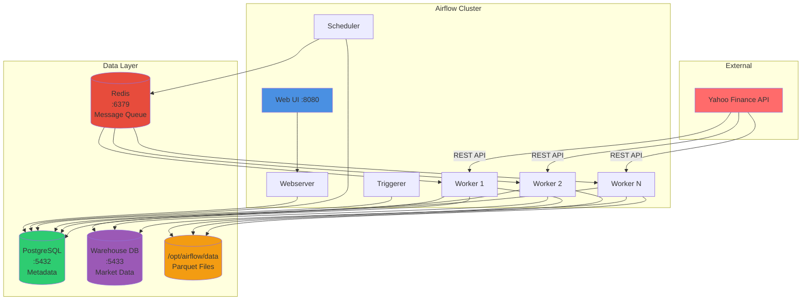
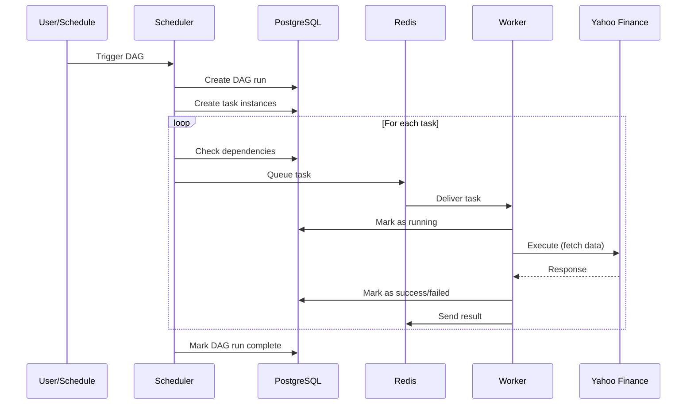
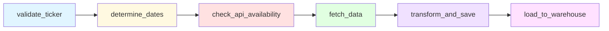
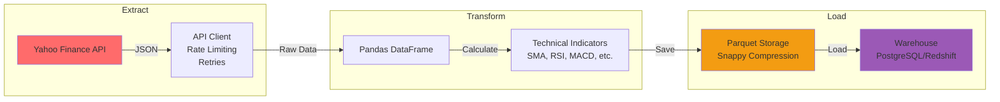
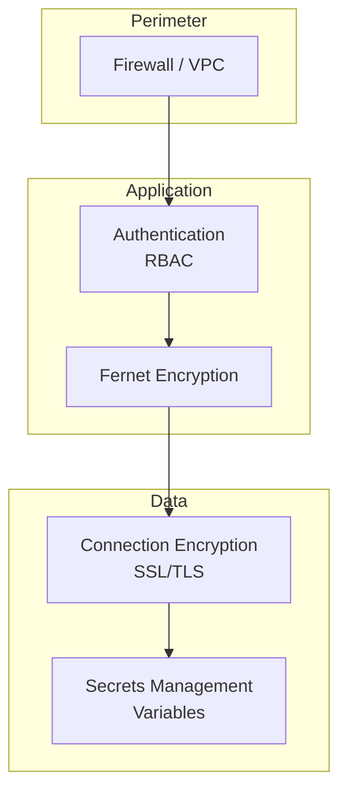

# System Architecture

Comprehensive overview of the Airflow Market Data Pipeline architecture, components, and design decisions.

---

## Table of Contents

- [Overview](#overview)
- [System Components](#system-components)
- [Execution Flow](#execution-flow)
- [DAG Architecture](#dag-architecture)
- [Data Flow](#data-flow)
- [Module Organization](#module-organization)
- [Design Patterns](#design-patterns)
- [Scalability](#scalability)
- [Security Architecture](#security-architecture)

---

## Overview

The system is built on **Apache Airflow 2.11** with **CeleryExecutor** for distributed task execution. It implements a complete ETL pipeline for market data with multi-environment warehouse support.

### Core Technologies

| Component | Technology | Version | Purpose |
|-----------|------------|---------|---------|
| **Orchestration** | Apache Airflow | 2.11.0 | Workflow management |
| **Executor** | CeleryExecutor | - | Distributed task execution |
| **Message Broker** | Redis | 7.2 | Celery queue |
| **Metadata DB** | PostgreSQL | 13 | Airflow metadata |
| **Data Warehouse** | PostgreSQL/Redshift | 13 / Latest | Data storage |
| **Container Platform** | Docker Compose | 2.0+ | Service orchestration |
| **Language** | Python | 3.10 | Application code |

---

## System Components

### Infrastructure Diagram



### Component Descriptions

#### **1. Webserver**
- **Purpose**: Serves the Airflow UI
- **Port**: 8080
- **Responsibilities**:
  - User authentication
  - DAG visualization
  - Task monitoring
  - Log viewing
- **Scaling**: Can run multiple instances behind a load balancer

#### **2. Scheduler**
- **Purpose**: Orchestrates DAG execution
- **Responsibilities**:
  - Parse DAG files
  - Create task instances
  - Queue tasks to Celery
  - Monitor task states
- **Scaling**: Run 2-3 instances for high availability

#### **3. Workers**
- **Purpose**: Execute tasks
- **Scaling**: Horizontal scaling (add more workers)
- **Responsibilities**:
  - Pick tasks from Redis queue
  - Execute Python callables
  - Update task status
  - Handle retries

#### **4. Triggerer**
- **Purpose**: Handle deferrable operators
- **Use Case**: Long-running sensors
- **Benefit**: Frees up worker slots

#### **5. Redis (Message Broker)**
- **Purpose**: Celery task queue
- **Port**: 6379
- **Data**: Task messages, results
- **Persistence**: Optional (AOF/RDB)

#### **6. PostgreSQL (Metadata)**
- **Purpose**: Airflow state management
- **Port**: 5432
- **Data**: DAG runs, task instances, connections, variables
- **Critical**: Must be highly available

#### **7. PostgreSQL (Warehouse)**
- **Purpose**: Market data storage
- **Port**: 5433 (external)
- **Data**: Enriched market data with indicators
- **Environment**: Development only (Redshift for staging/prod)

---

## Execution Flow

### Task Lifecycle



### Step-by-Step Flow

1. **Trigger**: DAG triggered manually or by schedule
2. **Parse**: Scheduler parses DAG file
3. **Create**: Task instances created in metadata DB
4. **Dependency Check**: Scheduler checks task dependencies
5. **Queue**: Ready tasks queued to Redis
6. **Pickup**: Worker picks up task from queue
7. **Execute**: Worker executes Python callable
8. **Update**: Worker updates task status in DB
9. **Retry**: Failed tasks retry based on retry policy
10. **Complete**: DAG run marked as success/failed

---

## DAG Architecture

### Market Data DAG Structure



### Task Details

| Task | Type | Retries | Timeout | Purpose |
|------|------|---------|---------|---------|
| `validate_ticker` | PythonOperator | 0 | - | Validate ticker format |
| `determine_dates` | PythonOperator | 2 | - | Decide dates to fetch |
| `check_api_availability` | PythonSensor | 5 | 600s | Check API health |
| `fetch_data` | PythonOperator | 3 | - | Fetch from Yahoo Finance |
| `transform_and_save` | PythonOperator | 2 | - | Calculate indicators |
| `load_to_warehouse` | PythonOperator | 2 | - | Load to warehouse |

### Task Communication (XCom)

Tasks communicate via **XCom** (Cross-Communication):

```python
# Push data
ti.xcom_push(key='ticker', value='AAPL')

# Pull data
ticker = ti.xcom_pull(task_ids='validate_ticker', key='return_value')
```

**XCom Flow**:
```
validate_ticker → (ticker: AAPL) → determine_dates
determine_dates → (dates: [2025-11-01, ...]) → fetch_data
fetch_data → (raw_data: [...]) → transform_and_save
validate_ticker → (ticker: AAPL) → load_to_warehouse
```

---

## Data Flow

### End-to-End Pipeline



### Data Transformations

1. **Raw API Response** (JSON)
```json
{
  "chart": {
    "result": [{
      "timestamp": [1699549200],
      "indicators": {
        "quote": [{
          "open": [259.45],
          "high": [260.61],
          "low": [258.87],
          "close": [259.57],
          "volume": [45123456]
        }]
      }
    }]
  }
}
```

2. **Parsed DataFrame** (Pandas)
```
ticker | date       | open   | high   | low    | close  | volume
-------|------------|--------|--------|--------|--------|----------
AAPL   | 2025-11-09 | 259.45 | 260.61 | 258.87 | 259.57 | 45123456
```

3. **Enriched with Indicators**
```
+ sma_7 | sma_14 | rsi  | macd  | bb_upper | volatility_20d
--------|--------|------|-------|----------|---------------
  258.3 | 257.8  | 68.4 | 1.23  | 262.45   | 0.0156
```

4. **Stored in Parquet** (`/opt/airflow/data/AAPL_market_data.parquet`)

5. **Loaded to Warehouse** (PostgreSQL `fact_market_data` table)

---

## Module Organization

### Package Structure

```
dags/market_data/
│
├── config/                    # Configuration Management
│   ├── __init__.py           # Exports
│   ├── settings.py           # Airflow Variables + Env Vars
│   ├── logging_config.py     # Logging setup
│   └── warehouse_config.py   # Warehouse configuration
│
├── operators/                 # Task Operators
│   ├── market_data_operators.py   # Validate, fetch, process
│   ├── transform_operators.py     # Transform & backfill
│   └── warehouse_operators.py     # Warehouse loading
│
├── sensors/                   # Custom Sensors
│   └── api_sensor.py         # API availability check
│
├── utils/                     # Utility Functions
│   ├── api_client.py         # Yahoo Finance client
│   ├── validators.py         # Input validation
│   └── logger.py             # Centralized logging
│
├── transformers/              # Data Transformations
│   └── technical_indicators.py    # Indicator calculations
│
├── storage/                   # Data Persistence
│   └── parquet_storage.py    # Parquet operations
│
└── warehouse/                 # Data Warehouse
    ├── connection.py         # Connection pooling
    └── loader.py             # Loading strategies
```

### Module Responsibilities

| Module | Purpose | Key Classes/Functions |
|--------|---------|----------------------|
| `config` | Configuration management | `get_config()`, `WAREHOUSE_CONFIG` |
| `operators` | Task executables | `validate_ticker()`, `fetch_data()` |
| `sensors` | Polling operators | `check_api_availability()` |
| `utils` | Reusable utilities | `YahooFinanceClient`, `validate_ticker_format()` |
| `transformers` | Data transformations | `calculate_technical_indicators()` |
| `storage` | File operations | `save_to_parquet()`, `load_from_parquet()` |
| `warehouse` | Database operations | `WarehouseConnection`, `WarehouseLoader` |

---

## Design Patterns

### 1. **Factory Pattern** (Warehouse Connection)

```python
def get_warehouse_connection(config: Dict) -> WarehouseConnection:
    """Factory for creating environment-specific connections"""
    if config['type'] == 'postgresql':
        return WarehouseConnection(config, pool_type=QueuePool)
    elif config['type'] == 'redshift':
        return WarehouseConnection(config, pool_type=NullPool)
```

### 2. **Strategy Pattern** (Load Strategies)

```python
class WarehouseLoader:
    def load(self, strategy: str):
        if strategy == 'upsert':
            return self._load_upsert()
        elif strategy == 'append':
            return self._load_append()
        elif strategy == 'truncate_insert':
            return self._load_truncate_insert()
```

### 3. **Decorator Pattern** (Logging)

```python
@log_execution()
def fetch_market_data(ticker: str, date: str):
    # Automatically logs execution time and errors
    pass
```

### 4. **Context Manager** (Database Transactions)

```python
with connection.get_connection() as conn:
    # Automatic commit on success
    # Automatic rollback on error
    conn.execute("INSERT INTO ...")
```

### 5. **Singleton Pattern** (Logger)

```python
logger = MarketDataLogger(__name__)  # Reused across module
```

---

## Scalability

### Horizontal Scaling

#### **Workers**
```yaml
# Scale to 5 workers
docker compose up -d --scale airflow-worker=5
```

**Considerations**:
- Each worker consumes ~512MB RAM
- Monitor CPU usage per worker
- Ensure network I/O capacity

#### **Scheduler** (High Availability)
```yaml
# Run 2 schedulers for HA
services:
  airflow-scheduler-1:
    # ... config ...
  airflow-scheduler-2:
    # ... config ...
```

### Vertical Scaling

#### **Resource Limits**
```yaml
services:
  airflow-worker:
    deploy:
      resources:
        limits:
          cpus: '2.0'
          memory: 2G
        reservations:
          cpus: '1.0'
          memory: 1G
```

### Database Scaling

#### **Metadata DB**
- Use PostgreSQL replication (primary + replica)
- Connection pooling (PgBouncer)
- Read replicas for reporting

#### **Warehouse**
- PostgreSQL: Vertical scaling + partitioning
- Redshift: Horizontal scaling (resize cluster)

---

## Security Architecture

### Layers of Security



### Security Features

1. **Authentication**
   - Admin user credentials (configurable)
   - RBAC for role-based access

2. **Encryption**
   - Fernet key for connection encryption
   - SSL/TLS for database connections
   - HTTPS for webserver (production)

3. **Secrets Management**
   - Environment variables (`.env`)
   - Airflow Variables (encrypted in DB)
   - External: AWS Secrets Manager, HashiCorp Vault

4. **Network Security**
   - Docker internal network
   - Port exposure control
   - VPC for production (AWS/GCP/Azure)

---

## Performance Considerations

### Optimization Points

| Component | Optimization | Impact |
|-----------|--------------|--------|
| **API Client** | Connection pooling, keep-alive | Faster requests |
| **Pandas** | Vectorized operations | Faster calculations |
| **Parquet** | Columnar storage, compression | Faster I/O |
| **Warehouse** | Batch inserts, indexes | Faster writes/queries |
| **Celery** | Result backend tuning | Faster task acknowledgment |

### Monitoring Metrics

- **DAG Duration**: Target <5 min for single day fetch
- **Task Duration**: Monitor individual task times
- **Worker Utilization**: Keep <80% busy
- **Queue Depth**: Monitor Redis queue length
- **Database Connections**: Monitor connection pool usage

---

## Technology Decisions

### Why CeleryExecutor?

| Pro | Con |
|-----|-----|
| Horizontal scaling | More complex setup |
| Task parallelism | Requires Redis/RabbitMQ |
| Production-ready | Higher resource usage |

**Alternative**: LocalExecutor (development), KubernetesExecutor (cloud-native)

### Why PostgreSQL for Warehouse (Dev)?

- Docker-friendly
- Full SQL support
- Easy local development
- Compatible with Redshift syntax (mostly)

### Why Redshift for Warehouse (Prod)?

- Columnar storage (analytics workload)
- Scalable (resize cluster)
- AWS ecosystem integration
- Cost-effective for large datasets

### Why Parquet?

- Columnar format (fast reads)
- Compression (50-80% smaller)
- Schema evolution support
- Wide ecosystem support (Spark, Pandas, Arrow)

---

## Future Architecture Improvements

### Potential Enhancements

1. **Kubernetes Deployment**
   - Use KubernetesExecutor
   - Auto-scaling workers
   - Better resource management

2. **Data Lake Integration**
   - S3/GCS for raw data storage
   - Athena/BigQuery for ad-hoc queries

3. **Streaming Pipeline**
   - Kafka for real-time data
   - Flink/Spark Streaming for processing

4. **Machine Learning Integration**
   - Model training DAGs
   - Feature store integration
   - A/B testing framework

5. **Multi-Region Deployment**
   - Global load balancing
   - Data replication
   - Disaster recovery

---

## Related Documentation

- [Configuration Guide](../user-guide/configuration.md)
- [Testing Guide](testing.md)
- [Operations Guide](../operations/deployment.md)
- [API Reference](api-reference.md)

