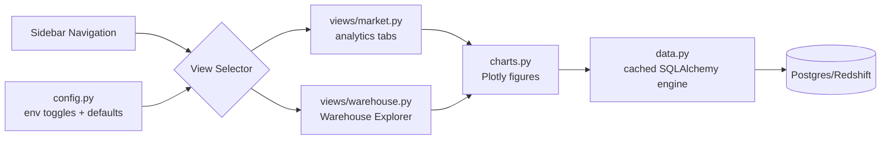

# Market Data Dashboard - User Guide

Interactive web dashboard for visualizing market data and technical indicators.

---

## Overview

The Market Data Dashboard is a **Streamlit-based web application** that provides interactive visualizations of market data stored in your Data Warehouse.

**Key Features**:
- 📊 Interactive charts with Plotly and enhanced tooltips
- 🔄 Real-time data from warehouse
- 🌍 Multi-environment support (dev/staging/prod)
- 🎛️ View switcher for Market Dashboard or Warehouse Explorer
- 📈 7 visualization tabs for market analytics
- 📊 Enhanced KPI Panel with percentage changes and indicator alerts
- 🔀 Multi-Ticker Comparator with correlation analysis
- 🏭 Warehouse explorer with SQL preview and filters
- ⬇️ Enhanced data export (CSV, Excel, JSON, Parquet)
- 📋 Query sharing (SQL and Python code)
- 🎨 Centralized icon system for consistent UI/UX
- 🚀 Dockerized deployment

**Access**: http://localhost:8501 (default)

---

### Modular Architecture

The dashboard codebase is split into reusable modules:

- `app.py` — lightweight entry point that sets Streamlit config and routes between experiences.
- `config.py` — environment-aware settings, view toggles, and sidebar navigation helpers.
- `icons.py` — centralized icon system for consistent UI/UX across all components.
- `data.py` — cached SQLAlchemy engine plus all warehouse query helpers (parameterized + sanitized).
- `charts.py` — Plotly chart builders for each analytic tab with enhanced tooltips.
- `views/market.py` & `views/warehouse.py` — isolated Streamlit views so each experience can evolve independently or be reused in other apps.
- `components/` — reusable UI components:
  - `kpi_panel.py` — Enhanced KPI panel with percentage changes and indicator status
  - `ticker_comparator.py` — Multi-ticker comparison with normalized charts and correlation
  - `export.py` — Multi-format data export (CSV, Excel, JSON, Parquet)

This structure keeps the UI flexible (new tabs/views are simple Python modules) and makes it easier to test or lint individual layers.



---

## Quick Start

### 1. Setup Environment

```bash
# From dashboard directory
cd dashboard
cp env.template .env

# Edit with your credentials
nano .env
```

**Minimum configuration** (Docker):
```bash
ENVIRONMENT=development
DEV_WAREHOUSE_HOST=warehouse-postgres  # Docker service name
DEV_WAREHOUSE_PORT=5432                # Internal Docker port
DEV_WAREHOUSE_PASSWORD=your_password
```

**For local development** (without Docker):
```bash
ENVIRONMENT=development
DEV_WAREHOUSE_HOST=localhost      # Connect to host
DEV_WAREHOUSE_PORT=5433            # Exposed port
DEV_WAREHOUSE_PASSWORD=your_password
```

### 2. Start Dashboard

**Using Makefile** (recommended):
```bash
# From project root
make dashboard
```

**Using Docker Compose**:
```bash
cd dashboard
docker compose up -d
```

**Local Development** (without Docker):
```bash
cd dashboard
pip install -r requirements.txt
streamlit run app.py
```

### 3. Access Dashboard

Open browser at: **http://localhost:8501**

Use the **Navigation** section in the sidebar to choose between the Market Data Dashboard
or the Warehouse Explorer experience.

---

## Features

### 1. View Mode Selection

**Sidebar** → View Mode radio button

Choose between:
- **Single Ticker**: Analyze one ticker in detail
- **Compare Tickers**: Compare multiple tickers side-by-side

### 2. Ticker Selection

**Single Ticker Mode**:
- Select one ticker from dropdown
- Dynamically loads available tickers from warehouse
- Automatically updates when new tickers are added

**Compare Tickers Mode**:
- Select multiple tickers (2 or more) from multiselect
- Maximum recommended: 5 tickers for optimal performance
- Compare normalized price charts, metrics, and correlations

### 3. Enhanced KPI Panel

At the top of the Market Data Dashboard, view comprehensive key performance indicators:

**Percentage Changes**:
- **1D**: 1-day change
- **7D**: 7-day change
- **30D**: 30-day change
- **YTD**: Year-to-date change

**Volatility Status**:
- Current volatility vs. historical average
- Visual alerts for high/low volatility conditions

**Indicator Status**:
- **RSI**: 
  - 🔴 Overbought (>70)
  - 🟢 Oversold (<30)
  - ➡️ Neutral (30-70)
- **MACD**:
  - 🟢 Bullish (MACD > Signal)
  - 🔴 Bearish (MACD < Signal)

### 4. Multi-Ticker Comparison

When in "Compare Tickers" mode with 2+ tickers selected:

**Normalized Price Chart**:
- All prices normalized to start at the same base value
- Easy visual comparison of relative performance

**Comparative Metrics Table**:
- Current price, 7D change, 30D change
- Volatility, Sharpe ratio
- RSI and MACD status
- Side-by-side comparison

**Correlation Analysis**:
- Returns correlation matrix heatmap
- Identify tickers that move together or independently

**Batch Export**:
- Export data for multiple selected tickers
- Available formats: CSV, Excel, JSON, Parquet

### 5. Date Range Selection

Choose from predefined ranges:
- **1 Month**: Last 30 days
- **3 Months**: Last 90 days
- **6 Months**: Last 180 days (default)
- **1 Year**: Last 365 days
- **All Data**: All available data

### 6. Visualization Tabs

All charts feature **enhanced tooltips** with comprehensive information:
- Date and time
- OHLCV values
- All relevant technical indicators
- Consistent formatting (currency, percentages)

#### Tab 1: Price & Volume

**Candlestick Chart**:
- Open, High, Low, Close (OHLC)
- Enhanced tooltips with comprehensive OHLCV information
- Interactive hover for details
- Zoom and pan

**Volume Bars**:
- Green: Price up
- Red: Price down

**Metrics**:
- Current Price (with % change)
- High (period)
- Low (period)
- Average Volume

#### Tab 2: Moving Averages

**Chart**:
- Close price (black line)
- SMA 7 (blue dotted)
- SMA 14 (orange dashed)
- SMA 20 (red solid)

**Usage**:
- **Golden Cross**: SMA 7 crosses above SMA 20 (bullish)
- **Death Cross**: SMA 7 crosses below SMA 20 (bearish)

**Metrics**:
- Current SMA 7, 14, 20 values

#### Tab 3: Bollinger Bands

**Chart**:
- Price line
- Upper band (2 std dev above)
- Middle band (SMA 20)
- Lower band (2 std dev below)
- Shaded area between bands

**Usage**:
- Price near **upper band**: Potentially overbought
- Price near **lower band**: Potentially oversold
- **Squeeze**: Narrow bands indicate low volatility (breakout likely)
- **Expansion**: Wide bands indicate high volatility

**Metrics**:
- Current Upper, Middle, Lower band values

#### Tab 4: RSI (Relative Strength Index)

**Chart**:
- RSI line (purple)
- Overbought line (70, red)
- Oversold line (30, green)
- Neutral line (50, gray)

**Interpretation**:
- **RSI > 70**: Overbought (potential reversal down)
- **RSI < 30**: Oversold (potential reversal up)
- **RSI = 50**: Neutral

**Alert Indicator**:
- Red: ⚠️ Overbought (>70)
- Green: ✅ Oversold (<30)
- Blue: ➡️ Neutral (30-70)

#### Tab 5: MACD

**Chart**:
- MACD line (blue)
- Signal line (red)
- Histogram (green/red bars)
- Zero line

**Usage**:
- **MACD crosses above Signal**: Bullish
- **MACD crosses below Signal**: Bearish
- **Histogram > 0**: Bullish momentum
- **Histogram < 0**: Bearish momentum

**Metrics**:
- Current MACD, Signal, Histogram values

#### Tab 6: Returns & Volatility

**Two Charts**:

1. **Daily Returns** (bar chart):
   - Green bars: Positive returns
   - Red bars: Negative returns
   - Shows daily % change

2. **20-Day Volatility** (area chart):
   - Rolling 20-day standard deviation
   - Higher volatility = higher risk

**Metrics**:
- Average Daily Return
- Standard Deviation of Returns
- Average Volatility
- **Sharpe Ratio**: Risk-adjusted return (higher is better)

**Sharpe Ratio Interpretation**:
- **< 1**: Poor risk-adjusted return
- **1-2**: Good
- **2-3**: Very good
- **> 3**: Excellent

#### Tab 7: Data Table

**Raw Data View**:
- Sortable columns
- Filterable
- Toggle to show all columns or key columns only

**Enhanced Export Features**:
- Multiple export formats: CSV, Excel, JSON, Parquet
- Export current view/chart data from any tab
- Batch export for multiple tickers (in Compare mode)
- Includes all OHLCV data
- All technical indicators
- Timestamps

---

## Warehouse Explorer View

Switch to **Warehouse Explorer** using the sidebar navigation (top-left). This dedicated
view lives outside the market tabs and is ideal when you need raw SQL visibility:

- Browse any schema/table available in the warehouse (dev/staging/prod)
- Apply ticker/date filters or add custom SQL predicates
- Review live SQL statements with bound parameters before execution
- Visualize record distribution by date or ticker when columns exist
- Preview the full result set, export in multiple formats (CSV, Excel, JSON, Parquet), and inspect column metadata
- **Share Query** functionality: Copy SQL query and Python code to reproduce queries
- Click **🔄 Refresh warehouse data** whenever new records land or you adjust filters; the button clears cached queries and reruns the explorer instantly.
- Built-in guard rails enforce **read-only access**: only `SELECT` statements are executed, custom predicates are validated against a deny-list of DDL/DML keywords, and bound parameters are used for ticker/date filters to avoid SQL injection.

> **Note**  
> If you paste a filter that contains destructive keywords (e.g., `DROP`, `INSERT`, `ALTER`, comments, or multiple statements), the explorer blocks it and explains why. This keeps the shared warehouse safe even when exposing raw SQL to power users.

You can disable or hide this view via the new environment variables:

```bash
ENABLE_MARKET_VIEW=true
ENABLE_WAREHOUSE_VIEW=true
DEFAULT_DASHBOARD_VIEW=market
```

Set them in `dashboard/.env` to control which experiences are available and which one
loads by default.

---

## Configuration

### Environment Selection

Set `ENVIRONMENT` variable to switch warehouses:

```bash
# Development (PostgreSQL local)
ENVIRONMENT=development

# Staging (Redshift)
ENVIRONMENT=staging

# Production (Redshift)
ENVIRONMENT=production
```

**Auto-connects** to the correct warehouse based on environment.

### Dashboard Settings

```bash
# Customize dashboard
DASHBOARD_TITLE="Market Data Dashboard"
DASHBOARD_PORT=8501
DASHBOARD_HOST=0.0.0.0
```

### Warehouse Credentials

**Development** (PostgreSQL):

Docker:
```bash
DEV_WAREHOUSE_HOST=warehouse-postgres  # Service name
DEV_WAREHOUSE_PORT=5432                # Internal port
DEV_WAREHOUSE_DATABASE=market_data_warehouse
DEV_WAREHOUSE_USER=warehouse_user
DEV_WAREHOUSE_PASSWORD=your_password
```

Local (without Docker):
```bash
DEV_WAREHOUSE_HOST=localhost     # Local connection
DEV_WAREHOUSE_PORT=5433          # Exposed port
DEV_WAREHOUSE_DATABASE=market_data_warehouse
DEV_WAREHOUSE_USER=warehouse_user
DEV_WAREHOUSE_PASSWORD=your_password
```

**Production** (Redshift):
```bash
PROD_WAREHOUSE_HOST=cluster.region.redshift.amazonaws.com
PROD_WAREHOUSE_PORT=5439
PROD_WAREHOUSE_DATABASE=market_data_prod
PROD_WAREHOUSE_USER=your_user
PROD_WAREHOUSE_PASSWORD=your_password
PROD_WAREHOUSE_REGION=us-east-1
```

---

## Performance

### Caching

Dashboard uses **Streamlit caching** for performance:

- **Data cache**: 5 minutes (300s)
- **Engine cache**: Session lifetime
- **Auto-refresh**: Click "🔄 Refresh Data" button

### Optimization Tips

1. **Limit date range**: Don't load "All Data" for tickers with years of data
2. **Use Docker**: Better resource isolation
3. **Increase cache TTL**: Edit `@st.cache_data(ttl=600)` for 10 min cache

---

## Deployment

### Development

```bash
make dashboard
# Access: http://localhost:8501
```

### Production

**1. Configure production .env**:
```bash
cd dashboard
cp env.template .env
# Edit with production Redshift credentials
ENVIRONMENT=production
```

**2. Deploy with Docker**:
```bash
docker compose up -d
```

**3. Setup reverse proxy** (nginx):
```nginx
server {
    listen 80;
    server_name dashboard.yourdomain.com;
    
    location / {
        proxy_pass http://localhost:8501;
        proxy_http_version 1.1;
        proxy_set_header Upgrade $http_upgrade;
        proxy_set_header Connection "upgrade";
        proxy_set_header Host $host;
    }
}
```

### Cloud Deployment (AWS EC2)

```bash
# On EC2 instance
git clone https://github.com/avalosjuancarlos/poc_airflow.git
cd poc_airflow/dashboard

# Configure
cp env.template .env
nano .env  # Set production credentials

# Start
docker compose up -d

# Access via public IP or domain
http://<EC2_PUBLIC_IP>:8501
```

---

## Troubleshooting

### No Tickers in Dropdown

**Cause**: No data in warehouse

**Solution**:
1. Run the Airflow DAG at least once
2. Verify data exists:
   ```bash
   make db-warehouse-stats
   ```

### Connection Error

**Error**: `could not connect to server`

**Solutions**:

1. **Check warehouse is running**:
   ```bash
   docker compose ps warehouse-postgres
   ```

2. **Verify credentials**:
   ```bash
   grep DEV_WAREHOUSE dashboard/.env
   ```

3. **Test connection**:
   ```bash
   docker compose exec warehouse-postgres psql -U warehouse_user -d market_data_warehouse
   ```

### Dashboard Not Loading

**Error**: `This site can't be reached`

**Solutions**:

1. **Check dashboard is running**:
   ```bash
   cd dashboard
   docker compose ps
   ```

2. **Check logs**:
   ```bash
   make dashboard-logs
   ```

3. **Restart dashboard**:
   ```bash
   make dashboard-down
   make dashboard
   ```

### Slow Performance

**Causes**:
- Large dataset
- Slow database queries
- No indexes

**Solutions**:

1. **Limit date range**: Use 3M or 6M instead of "All Data"

2. **Add database indexes**:
   ```sql
   CREATE INDEX idx_ticker_date ON fact_market_data (ticker, date DESC);
   ```

3. **Increase cache TTL**:
   ```python
   # In app.py
   @st.cache_data(ttl=600)  # 10 minutes
   ```

---

## Customization

### Add Custom Tab

Edit `dashboard/app.py`:

```python
# Add new visualization function
def plot_custom_indicator(df, ticker):
    fig = go.Figure()
    fig.add_trace(go.Scatter(x=df['date'], y=df['custom_indicator']))
    return fig

# Add to tabs list
tabs = st.tabs([..., "Custom Indicator"])

# Add content
with tabs[N]:
    st.plotly_chart(plot_custom_indicator(df, ticker))
```

### Change Theme

Create `.streamlit/config.toml`:

```toml
[theme]
primaryColor="#FF4B4B"
backgroundColor="#0E1117"
secondaryBackgroundColor="#262730"
textColor="#FAFAFA"
font="sans serif"
```

### Add Authentication

Use **Streamlit Authentication**:

```python
import streamlit_authenticator as stauth

# Add login
authenticator = stauth.Authenticate(config)
name, auth_status, username = authenticator.login('Login', 'main')

if auth_status:
    # Show dashboard
    main()
else:
    st.error('Username/password is incorrect')
```

---

## Makefile Commands

```bash
# Dashboard commands
make dashboard          # Start dashboard
make dashboard-down     # Stop dashboard
make dashboard-logs     # View logs
make dashboard-local    # Run locally (no Docker)

# All services
make all               # Start Airflow + Dashboard
make stop-all          # Stop everything
make health            # Check all services
```

---

## Related Documentation

- [Data Warehouse Guide](data-warehouse.md)
- [Market Data DAG Guide](market-data-dag.md)
- [Configuration Guide](configuration.md)
- [Dashboard README](../../dashboard/README.md)

---

**Last Updated**: 2025-11-18  
**Version**: 2.0.0  
**Technology**: Streamlit + Plotly + SQLAlchemy

### Recent Updates (Phase 1 Improvements - 2025-11-18)

- ✅ **Enhanced KPI Panel**: Percentage changes (1D, 7D, 30D, YTD), volatility status, indicator alerts
- ✅ **Multi-Ticker Comparator**: Normalized charts, comparative metrics table, correlation analysis
- ✅ **Enhanced Tooltips**: Comprehensive hover information in all charts
- ✅ **Enhanced Data Export**: Multiple formats (CSV, Excel, JSON, Parquet), batch export, query sharing
- ✅ **Centralized Icon System**: Consistent UI/UX across all components
- ✅ **Configurable Thresholds**: RSI and volatility thresholds via environment variables

For detailed improvement plan, see [Dashboard Improvements Plan](../../developer-guide/dashboard-improvements.md).

