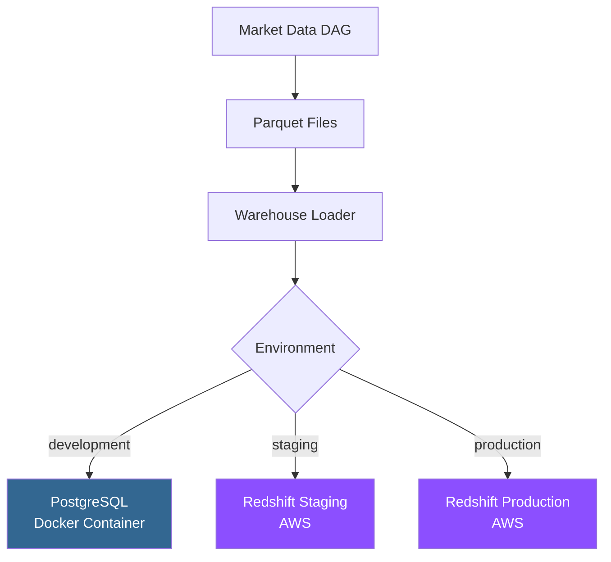

# Data Warehouse - User Guide

## Overview

The Data Warehouse integration provides a centralized repository for market data with support for multiple environments and databases.

**Supported Databases:**
- 🐘 **PostgreSQL** (Development)
- 🔴 **Amazon Redshift** (Staging/Production)

**Key Features:**
- ✅ Multi-environment configuration
- ✅ Automatic schema creation
- ✅ Multiple load strategies (UPSERT, APPEND, TRUNCATE_INSERT)
- ✅ Batch processing for performance
- ✅ Transaction management (commit/rollback)
- ✅ Connection pooling
- ✅ Structured logging

---

## Architecture



---

## Environment Configuration

### Development (PostgreSQL)

**Docker Service**: `warehouse-postgres`

The development warehouse runs as a dedicated PostgreSQL Docker container, separate from the Airflow metadata database.

**Connection Details**:
```bash
Host: warehouse-postgres
Port: 5432 (internal), 5433 (external)
Database: market_data_warehouse
Schema: public
User: warehouse_user
```

**docker-compose.yml**:
```yaml
services:
  warehouse-postgres:
    image: postgres:13
    container_name: warehouse-postgres
    environment:
      POSTGRES_USER: warehouse_user
      POSTGRES_PASSWORD: ${DEV_WAREHOUSE_PASSWORD}
      POSTGRES_DB: market_data_warehouse
      PGDATA: /var/lib/postgresql/data/pgdata
    ports:
      - "5433:5432"
    volumes:
      - warehouse-db-volume:/var/lib/postgresql/data/pgdata
      - ./scripts/init_warehouse_schema.sql:/docker-entrypoint-initdb.d/init.sql
    user: "999:999"  # Run as postgres user (non-root)
    healthcheck:
      test: ["CMD", "pg_isready", "-U", "warehouse_user"]
      interval: 5s
      retries: 5
```

**Environment Variables** (`.env`):
```bash
ENVIRONMENT=development

DEV_WAREHOUSE_HOST=warehouse-postgres
DEV_WAREHOUSE_PORT=5432
DEV_WAREHOUSE_DATABASE=market_data_warehouse
DEV_WAREHOUSE_SCHEMA=public
DEV_WAREHOUSE_USER=warehouse_user
DEV_WAREHOUSE_PASSWORD=your_secure_password
```

### Staging (Amazon Redshift)

**Connection Details**:
```bash
Host: your-staging-cluster.region.redshift.amazonaws.com
Port: 5439
Database: market_data_staging
Schema: public
```

**Environment Variables** (`.env`):
```bash
ENVIRONMENT=staging

STAGING_WAREHOUSE_TYPE=redshift
STAGING_WAREHOUSE_HOST=your-staging-cluster.region.redshift.amazonaws.com
STAGING_WAREHOUSE_PORT=5439
STAGING_WAREHOUSE_DATABASE=market_data_staging
STAGING_WAREHOUSE_SCHEMA=public
STAGING_WAREHOUSE_USER=your_staging_user
STAGING_WAREHOUSE_PASSWORD=your_staging_password
STAGING_WAREHOUSE_REGION=us-east-1
```

### Production (Amazon Redshift)

**Connection Details**:
```bash
Host: your-prod-cluster.region.redshift.amazonaws.com
Port: 5439
Database: market_data_prod
Schema: public
```

**Environment Variables** (`.env`):
```bash
ENVIRONMENT=production

PROD_WAREHOUSE_TYPE=redshift
PROD_WAREHOUSE_HOST=your-prod-cluster.region.redshift.amazonaws.com
PROD_WAREHOUSE_PORT=5439
PROD_WAREHOUSE_DATABASE=market_data_prod
PROD_WAREHOUSE_SCHEMA=public
PROD_WAREHOUSE_USER=your_prod_user
PROD_WAREHOUSE_PASSWORD=your_prod_password
PROD_WAREHOUSE_REGION=us-east-1
```

---

## Load Strategies

### 1. UPSERT (Default)

**When to use**: Daily incremental loads with potential updates to existing records

**Behavior**:
- Insert new records
- Update existing records (matched by `ticker` + `date`)
- Preserves `created_at`, updates `updated_at`

**Configuration**:
```bash
WAREHOUSE_LOAD_STRATEGY=upsert
```

**Example**:
```sql
-- PostgreSQL
INSERT INTO fact_market_data (ticker, date, close, ...)
VALUES ('AAPL', '2025-01-15', 259.57, ...)
ON CONFLICT (ticker, date) 
DO UPDATE SET 
    close = EXCLUDED.close,
    sma_7 = EXCLUDED.sma_7,
    updated_at = CURRENT_TIMESTAMP;

-- Redshift (uses DELETE + INSERT)
DELETE FROM fact_market_data 
WHERE (ticker, date) IN (SELECT ticker, date FROM temp_staging);

INSERT INTO fact_market_data 
SELECT * FROM temp_staging;
```

### 2. APPEND

**When to use**: Fast bulk loads where duplicates are acceptable or handled elsewhere

**Behavior**:
- Insert all records
- No duplicate checking
- Fastest strategy

**Configuration**:
```bash
WAREHOUSE_LOAD_STRATEGY=append
```

**Example**:
```sql
INSERT INTO fact_market_data (ticker, date, close, ...)
VALUES ('AAPL', '2025-01-15', 259.57, ...);
```

### 3. TRUNCATE_INSERT

**When to use**: Full refresh scenarios, test environments

**Behavior**:
- Truncate entire table
- Insert all records
- ⚠️ **WARNING**: Deletes all existing data

**Configuration**:
```bash
WAREHOUSE_LOAD_STRATEGY=truncate_insert
```

**Example**:
```sql
TRUNCATE TABLE fact_market_data;

INSERT INTO fact_market_data (ticker, date, close, ...)
VALUES ...;
```

---

## Database Schema

### fact_market_data

Complete schema with all columns:

```sql
CREATE TABLE fact_market_data (
    -- Primary Key
    id SERIAL PRIMARY KEY,
    
    -- Business Keys
    ticker VARCHAR(10) NOT NULL,
    date DATE NOT NULL,
    
    -- OHLCV (Open, High, Low, Close, Volume)
    open NUMERIC(10,2),
    high NUMERIC(10,2),
    low NUMERIC(10,2),
    close NUMERIC(10,2) NOT NULL,
    volume BIGINT,
    
    -- Moving Averages
    sma_7 NUMERIC(10,2),
    sma_14 NUMERIC(10,2),
    sma_30 NUMERIC(10,2),
    
    -- Momentum Indicators
    rsi NUMERIC(10,2),  -- Relative Strength Index
    
    -- Trend Indicators
    macd NUMERIC(10,2),  -- MACD Line
    macd_signal NUMERIC(10,2),  -- Signal Line
    macd_histogram NUMERIC(10,2),  -- Histogram
    
    -- Volatility Indicators
    bb_upper NUMERIC(10,2),  -- Bollinger Band Upper
    bb_middle NUMERIC(10,2),  -- Bollinger Band Middle
    bb_lower NUMERIC(10,2),  -- Bollinger Band Lower
    
    -- Returns & Risk
    daily_return NUMERIC(10,4),  -- Daily % change
    volatility_20d NUMERIC(10,4),  -- 20-day volatility
    
    -- Metadata
    currency VARCHAR(10),
    exchange_name VARCHAR(50),
    instrument_type VARCHAR(50),
    fifty_two_week_high NUMERIC(10,2),
    fifty_two_week_low NUMERIC(10,2),
    fifty_day_average NUMERIC(10,2),
    two_hundred_day_average NUMERIC(10,2),
    market_cap BIGINT,
    
    -- Audit Timestamps
    created_at TIMESTAMP DEFAULT CURRENT_TIMESTAMP,
    updated_at TIMESTAMP DEFAULT CURRENT_TIMESTAMP,
    
    -- Constraints
    UNIQUE (ticker, date)
);

-- Indexes for query performance
CREATE INDEX idx_ticker_date ON fact_market_data (ticker, date DESC);
CREATE INDEX idx_date ON fact_market_data (date DESC);
CREATE INDEX idx_ticker ON fact_market_data (ticker);
```

### Data Types

| Column | Type | Description | Example |
|--------|------|-------------|---------|
| `ticker` | VARCHAR(10) | Stock ticker symbol | `AAPL` |
| `date` | DATE | Trading date | `2025-01-15` |
| `close` | NUMERIC(10,2) | Closing price | `259.57` |
| `volume` | BIGINT | Trading volume | `123456789` |
| `rsi` | NUMERIC(10,2) | RSI (0-100) | `68.42` |
| `daily_return` | NUMERIC(10,4) | Daily return % | `0.0234` (2.34%) |
| `volatility_20d` | NUMERIC(10,4) | 20-day volatility | `0.0156` (1.56%) |

---

## Connection Pooling

### PostgreSQL (QueuePool)

**Configuration**:
```bash
WAREHOUSE_POOL_SIZE=5  # Number of connections in pool
WAREHOUSE_MAX_OVERFLOW=10  # Max additional connections
WAREHOUSE_POOL_TIMEOUT=30  # Timeout in seconds
```

**Behavior**:
- Maintains a pool of reusable connections
- Efficient for frequent, short-lived queries
- Automatic connection recycling

### Redshift (NullPool)

**Configuration**:
```bash
# Same variables, but uses NullPool internally
```

**Behavior**:
- Creates new connection for each request
- Closes connection after use
- Better for infrequent, long-running queries
- Avoids connection timeout issues

---

## Batch Processing

Large datasets are processed in batches to optimize memory and performance.

**Configuration**:
```bash
WAREHOUSE_BATCH_SIZE=1000  # Records per batch
```

**Example**:
```
Loading 5,432 records
Batch 1/6: 1000 records ✅
Batch 2/6: 1000 records ✅
Batch 3/6: 1000 records ✅
Batch 4/6: 1000 records ✅
Batch 5/6: 1000 records ✅
Batch 6/6: 432 records ✅
```

---

## Transaction Management

All warehouse operations use transactions with automatic commit/rollback.

### Success Scenario

```python
with connection.get_connection() as conn:
    # Execute SQL
    conn.execute("INSERT INTO ...")
    # Automatic COMMIT on exit
```

**Log**:
```
✅ Successfully loaded 1000 records
Transaction committed
```

### Error Scenario

```python
with connection.get_connection() as conn:
    # Execute SQL
    conn.execute("INSERT INTO ...")
    # Error occurs
    raise Exception("Database error")
    # Automatic ROLLBACK
```

**Log**:
```
❌ Error loading to warehouse: Database error
Transaction rolled back
```

---

## Monitoring & Troubleshooting

### Check Warehouse Connection

```bash
# Development (PostgreSQL)
docker compose exec warehouse-postgres psql -U warehouse_user -d market_data_warehouse

# Test query
SELECT COUNT(*) FROM fact_market_data;
```

### View Recent Data

```sql
-- Last 10 records for AAPL
SELECT 
    ticker,
    date,
    close,
    sma_7,
    rsi,
    volatility_20d,
    created_at
FROM fact_market_data
WHERE ticker = 'AAPL'
ORDER BY date DESC
LIMIT 10;
```

### Check Data Quality

```sql
-- Records with missing indicators
SELECT 
    COUNT(*) as total_records,
    COUNT(close) as with_close,
    COUNT(sma_7) as with_sma_7,
    COUNT(rsi) as with_rsi,
    COUNT(macd) as with_macd
FROM fact_market_data
WHERE ticker = 'AAPL';
```

### Troubleshooting

#### Connection Errors

**Error**: `could not connect to server`

**Solution**:
```bash
# Check warehouse service is running
docker compose ps warehouse-postgres

# Check logs
docker compose logs warehouse-postgres

# Restart service
docker compose restart warehouse-postgres
```

#### Authentication Errors

**Error**: `password authentication failed`

**Solution**:
1. Verify credentials in `.env`
2. Ensure `DEV_WAREHOUSE_PASSWORD` matches Docker environment
3. Restart services after .env changes

#### Schema Errors

**Error**: `table "fact_market_data" does not exist`

**Solution**:
```bash
# Run initialization script
docker compose exec warehouse-postgres psql -U warehouse_user -d market_data_warehouse -f /docker-entrypoint-initdb.d/init.sql

# Or recreate from DAG (auto-creates tables)
airflow tasks test get_market_data load_to_warehouse 2025-01-15
```

---

## Security Best Practices

### Password Management

❌ **Never commit real passwords**:
```bash
# Bad
DEV_WAREHOUSE_PASSWORD=mysecretpass123
```

✅ **Use placeholder prefix**:
```bash
# Good (in env.template)
DEV_WAREHOUSE_PASSWORD=CHANGE_ME_dev_warehouse_password

# Real password (in .env, gitignored)
DEV_WAREHOUSE_PASSWORD=ActualSecurePassword123!
```

### Production Security

For staging/production Redshift:

1. **Use IAM Authentication** (recommended)
2. **Enable SSL/TLS** for connections
3. **Rotate credentials** regularly
4. **Use VPC** and security groups
5. **Enable audit logging**

See [SECURITY.md](../../SECURITY.md) for comprehensive security guidelines.

---

## Performance Tips

### 1. Optimize Batch Size

```bash
# Small datasets (<10K records)
WAREHOUSE_BATCH_SIZE=1000

# Large datasets (>100K records)
WAREHOUSE_BATCH_SIZE=5000
```

### 2. Use Appropriate Load Strategy

- **Daily updates**: UPSERT
- **Bulk historical loads**: APPEND
- **Full refresh**: TRUNCATE_INSERT

### 3. Monitor Connection Pool

```bash
# Increase pool size for concurrent DAG runs
WAREHOUSE_POOL_SIZE=10
WAREHOUSE_MAX_OVERFLOW=20
```

### 4. Index Optimization

```sql
-- Add indexes for your most common queries
CREATE INDEX idx_custom ON fact_market_data (ticker, date DESC, close);
```

---

## Migration Guide

### From Parquet-Only to Warehouse

If you have existing Parquet files, they will automatically be loaded to the warehouse on the next DAG run.

**No manual migration needed!**

The `load_to_warehouse` task:
1. Reads existing Parquet files
2. Filters valid records
3. Loads to warehouse using configured strategy

### Switching Environments

```bash
# 1. Update .env
ENVIRONMENT=staging  # Change from development

# 2. Restart Airflow
docker compose restart airflow-webserver airflow-scheduler airflow-worker

# 3. Verify configuration
docker compose exec airflow-webserver python -c "
from market_data.config.warehouse_config import get_warehouse_config
print(get_warehouse_config())
"
```

---

## API Reference

### Modules

- **`warehouse_config.py`**: Multi-environment configuration
- **`connection.py`**: Connection pooling and management
- **`loader.py`**: Data loading logic
- **`warehouse_operators.py`**: Airflow operator integration

### Key Functions

```python
# Get warehouse configuration
from market_data.config.warehouse_config import get_warehouse_config
config = get_warehouse_config()

# Get connection string
from market_data.config.warehouse_config import get_connection_string
conn_str = get_connection_string()

# Get warehouse connection
from market_data.warehouse import get_warehouse_connection
connection = get_warehouse_connection()

# Load data
from market_data.warehouse import load_parquet_to_warehouse
result = load_parquet_to_warehouse("AAPL")
```

---

## Related Documentation

- [Market Data DAG Guide](market-data-dag.md)
- [Configuration Guide](configuration.md)
- [Security Best Practices](../../SECURITY.md)
- [Testing Guide](../developer-guide/testing.md)

