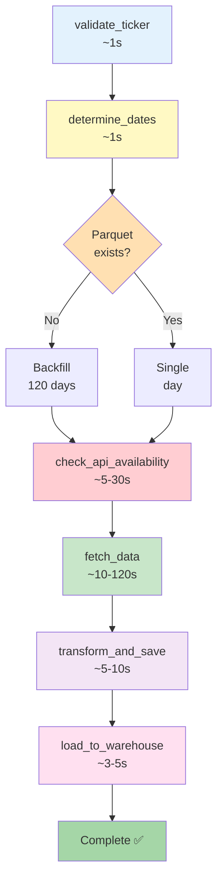

# Get Market Data DAG - Complete ETL Pipeline

Production DAG to fetch, transform, and store market data from Yahoo Finance API.

---

## 🎯 Description

**Complete ETL pipeline** that:
- **Extracts** data from Yahoo Finance API
- **Transforms** data by calculating 12 technical indicators
- **Loads** data to Parquet and Data Warehouse

**Schedule**: `0 23 * * 1-5` (6:00 PM ET / 23:00 UTC, Monday-Friday)

---

## ✨ Key Features

### 1. **Automatic Backfill** ✅
- **First execution** (no Parquet): Backfill of **120 historical days** (~6 months)
- **Subsequent executions**: Only **current day**
- Smart date determination logic

### 2. **12 Technical Indicators** ✅
#### Trend
- **SMA** (Simple Moving Average): 7, 14, 20 days
- **MACD** (Moving Average Convergence Divergence): Line, Signal, Histogram

#### Momentum
- **RSI** (Relative Strength Index): 14 days

#### Volatility
- **Bollinger Bands**: Upper, Middle, Lower (20 days, 2σ)
- **Volatility**: 20-day rolling standard deviation

#### Returns
- **Daily Return**: Daily percentage change

### 3. **Multi-Layer Storage** ✅
- **Parquet**: Local cache (compressed columnar format)
- **Data Warehouse**: PostgreSQL (dev) / Redshift (staging/prod)

### 4. **Smart Timestamp Logic** ✅
- **Historical dates**: Uses 6PM (after market close)
- **Today before 6PM**: Uses current time (avoids future timestamps)
- **Today after 6PM**: Uses 6PM
- **Prevents**: HTTP 400 errors

### 5. **Weekend Handling** ✅
- API returns empty data for weekends
- Code continues without failure
- Only valid trading days included

---

## 📊 DAG Structure

The DAG consists of **6 tasks** that run sequentially:

```
validate_ticker → determine_dates → check_api_availability → fetch_data → transform_and_save → load_to_warehouse
```

### Visual Flow Diagram



### Task Details

| Task ID | Type | Description | Retry | Timeout |
|---------|------|-------------|-------|---------|
| `validate_ticker` | PythonOperator | Validates ticker format | 0 | - |
| `determine_dates` | PythonOperator | Determines dates to fetch | 2 | - |
| `check_api_availability` | PythonSensor | Checks if API is responsive | 5 | 600s |
| `fetch_data` | PythonOperator | Fetches market data | 3 | - |
| `transform_and_save` | PythonOperator | Calculates indicators & saves | 2 | - |
| `load_to_warehouse` | PythonOperator | Loads data to warehouse | 2 | - |

---

## 🚀 Usage

### Using Makefile (Recommended)

```bash
# Trigger with default ticker (AAPL)
make dag-trigger

# Trigger with custom ticker
make dag-trigger TICKER=GOOGL

# View logs
make logs-worker

# Check DAG status
make dag-list
```

### Using Airflow UI

**First Execution (No Parquet)**:

1. Open http://localhost:8080
2. Enable `get_market_data` DAG
3. Trigger manually with:
   ```json
   {"ticker": "AAPL"}
   ```

**What happens**:
```
1. Validates ticker: AAPL ✅
2. Detects: AAPL_market_data.parquet doesn't exist
3. Determines dates: Last 120 days (~6 months)
4. Checks API: Available ✅
5. Fetches data: 120 requests (~85 trading days, ~35 weekends)
6. Transforms: Calculates 12 technical indicators
7. Saves: /opt/airflow/data/AAPL_market_data.parquet (~200KB)
8. Loads: PostgreSQL warehouse (~85 records)
```

**Result**: Parquet file with ~85 trading days + 12 indicators + Warehouse loaded

---

### Daily Executions (Parquet Exists)

**Automatic** (6:00 PM ET, Monday-Friday):
- Runs automatically at 23:00 UTC

**What happens**:
```
1. Validates ticker: AAPL ✅
2. Detects: AAPL_market_data.parquet exists
3. Determines dates: Today only (2025-11-14)
4. Checks API: Available ✅
5. Fetches data: 1 request for today
6. Transforms: Recalculates indicators for ENTIRE dataset
7. Saves: Appends to existing Parquet (~202KB now)
8. Loads: UPSERT to warehouse (1 new record)
```

**Result**: 1 new day added, all indicators updated

---

### Trigger with Different Ticker

Using Makefile:
```bash
make dag-trigger TICKER=TSLA
```

Using CLI:
```bash
docker compose exec airflow-scheduler airflow dags trigger get_market_data \
  --conf '{"ticker": "TSLA"}'
```

- If `TSLA_market_data.parquet` doesn't exist: 120-day backfill
- If exists: Only adds current day
- Each ticker has its own Parquet file

---

## 📦 Stored Data

### Parquet File Structure

**Columns** (32 total):

#### OHLCV Data
```
- ticker          (string)
- date            (datetime64[ns])
- timestamp       (int64)
- open            (float64)
- high            (float64)
- low             (float64)
- close           (float64)
- volume          (int64)
```

#### Technical Indicators - Trend
```
- sma_7           (float64)
- sma_14          (float64)
- sma_20          (float64)
- ema_12          (float64)
- macd            (float64)
- macd_signal     (float64)
- macd_histogram  (float64)
```

#### Momentum Indicators
```
- rsi             (float64)
```

#### Volatility Indicators
```
- bb_upper        (float64)
- bb_middle       (float64)
- bb_lower        (float64)
- volatility_20d  (float64)
```

#### Returns
```
- daily_return    (float64)
- daily_return_pct (float64)
```

#### Additional Metadata
```
- currency                (string)
- exchange               (string)
- instrument_type        (string)
- regular_market_price   (float64)
- fifty_two_week_high    (float64)
- fifty_two_week_low     (float64)
- long_name              (string)
- short_name             (string)
```

---

## 🔧 Configuration

### Environment Variables

```bash
# Storage
MARKET_DATA_STORAGE_DIR=/opt/airflow/data
MARKET_DATA_BACKFILL_DAYS=120  # Days to backfill on first run

# API
YAHOO_FINANCE_API_BASE_URL=https://query2.finance.yahoo.com/v8/finance/chart
MARKET_DATA_DEFAULT_TICKER=AAPL
MARKET_DATA_API_TIMEOUT=30

# Retry Logic
MARKET_DATA_MAX_RETRIES=3
MARKET_DATA_RETRY_DELAY=5

# Sensor
MARKET_DATA_SENSOR_POKE_INTERVAL=30
MARKET_DATA_SENSOR_TIMEOUT=600
MARKET_DATA_SENSOR_EXPONENTIAL_BACKOFF=true
```

See `configuration.md` for complete list.

---

## 🧪 Usage Examples

### Example 1: AAPL Backfill

```bash
# First execution
make dag-trigger TICKER=AAPL

# Result:
# - Fetch 120 days
# - ~85 trading days with data
# - ~35 weekend days (no data)
# - File: AAPL_market_data.parquet (85 records with 32 columns)
```

### Example 2: Daily Update

```bash
# Automatic daily execution or manual
make dag-trigger

# Result:
# - Fetch today only
# - Append to existing Parquet
# - Indicators recalculated for entire dataset
```

### Example 3: Multiple Tickers

```bash
# Trigger for each ticker
make dag-trigger TICKER=AAPL
make dag-trigger TICKER=TSLA
make dag-trigger TICKER=GOOGL

# Result:
# - Each ticker has its own Parquet
# - Independent backfill per ticker
# - Isolated data per ticker
```

---

## 📈 Output Example

### Execution Logs

```
[2025-11-14 23:00:00] INFO - Task: validate_ticker
[2025-11-14 23:00:01] INFO - Validated ticker: AAPL

[2025-11-14 23:00:01] INFO - Task: determine_dates
[2025-11-14 23:00:02] INFO - Parquet exists. Mode: incremental
[2025-11-14 23:00:02] INFO - Dates to fetch: ['2025-11-14']

[2025-11-14 23:00:02] INFO - Task: check_api_availability
[2025-11-14 23:00:07] INFO - API check successful. Available: True

[2025-11-14 23:00:07] INFO - Task: fetch_data
[2025-11-14 23:00:17] INFO - Fetched 1/1 dates successfully

[2025-11-14 23:00:17] INFO - Task: transform_and_save
[2025-11-14 23:00:22] INFO - Calculated 12 technical indicators
[2025-11-14 23:00:22] INFO - Saved 86 records to Parquet

[2025-11-14 23:00:22] INFO - Task: load_to_warehouse
[2025-11-14 23:00:25] INFO - Loaded 1 new record to warehouse
[2025-11-14 23:00:25] INFO - Total records in warehouse: 86
[2025-11-14 23:00:25] INFO - ✅ DAG execution complete
```

### Parquet File

```python
import pandas as pd

df = pd.read_parquet('/opt/airflow/data/AAPL_market_data.parquet')
print(df[['date', 'close', 'sma_7', 'rsi', 'macd']].tail())
```

**Output**:
```
        date   close   sma_7     rsi      macd
81  2025-11-10  260.12  258.91   72.34    1.45
82  2025-11-11  259.89  259.12   70.12    1.23
83  2025-11-12  259.57  259.31   68.42    1.01
84  2025-11-13  260.45  259.67   69.88    1.15
85  2025-11-14  261.23  260.04   71.56    1.34
```

---

## 🐛 Troubleshooting

### DAG not running on schedule

**Check**:
```bash
# Verify DAG is unpaused
make dag-list

# Check scheduler logs
make logs-scheduler
```

**Solution**:
```bash
# Unpause DAG
make dag-unpause
```

### API Rate Limit (429)

**Symptom**: `429 Too Many Requests`

**Solution**: Already handled automatically
- Exponential backoff (5s, 10s, 20s)
- Respects `Retry-After` header
- Retries up to 3 times

### No Data for Today

**Possible causes**:
1. Market not closed yet (run after 6 PM ET)
2. Weekend/holiday
3. API issue

**Check**:
```bash
# View API sensor logs
make logs-worker | grep "check_api_availability"
```

### Warehouse Load Failed

**Check connection**:
```bash
# Test warehouse
make db-warehouse-query

# View warehouse logs
docker compose logs warehouse-postgres
```

---

## 📊 Monitoring

### View Execution Progress

**Airflow UI**:
- Graph view: Visual task flow
- Grid view: Historical runs
- Gantt view: Timeline

**Logs**:
```bash
# Real-time worker logs
make logs-worker

# Specific task logs
docker compose exec airflow-scheduler airflow tasks logs get_market_data fetch_data 2025-11-14
```

### Data Verification

**Check Parquet**:
```bash
# List files
docker compose exec airflow-scheduler ls -lh /opt/airflow/data/

# Query with Python
docker compose exec airflow-scheduler python3 << 'EOF'
import pandas as pd
df = pd.read_parquet('/opt/airflow/data/AAPL_market_data.parquet')
print(f"Records: {len(df)}")
print(f"Date range: {df['date'].min()} to {df['date'].max()}")
EOF
```

**Check Warehouse**:
```bash
# View statistics
make db-warehouse-stats

# Query specific ticker
docker compose exec warehouse-postgres psql -U warehouse_user -d market_data_warehouse \
  -c "SELECT COUNT(*), MIN(date), MAX(date) FROM fact_market_data WHERE ticker='AAPL';"
```

---

## ⚙️ Advanced Configuration

### Change Backfill Days

```bash
# .env
MARKET_DATA_BACKFILL_DAYS=365  # 1 year backfill

# Restart
make restart
```

### Change Schedule

Edit `dags/get_market_data_dag.py`:

```python
# Current: 6:00 PM ET Monday-Friday
schedule_interval="0 23 * * 1-5"

# Alternative: Daily at midnight
schedule_interval="@daily"

# Alternative: Hourly
schedule_interval="@hourly"
```

### Enable Catchup

```python
# In DAG definition
catchup=True  # Will backfill missed runs
```

---

## 📚 Related Documentation

- [Dashboard Guide](dashboard.md) - Visualize your data
- [Data Warehouse Guide](data-warehouse.md) - Warehouse details
- [Configuration Guide](configuration.md) - All settings
- [API Reference](../developer-guide/api-reference.md) - Code documentation

---

**Last Updated**: 2025-11-14  
**Version**: 2.0.0  
**Schedule**: 6:00 PM ET Monday-Friday

